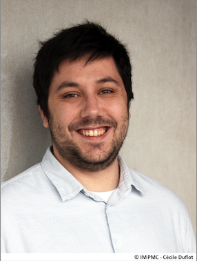

## Main developer

<table>
<tr>
<td>  </td>
<td>
 
<b>Alexander Wietek</b>  
Group Leader   
Superconductivity and Magnetic Correlations  
Max Planck Institute for the Physics of Complex Systems 
<a href="https://www.pks.mpg.de/smc">www.pks.mpg.de/smc</a> 
awietek _at_ pks.mpg.de

</td>
</tr>
</table>

 

---

## Scientific advisor

<table>
<tr>
<td>  </td>
<td>
 
<b>Andreas M. Läuchli</b>  
Full Professor  
École Polytechnique Fédérale de Lausanne <a href="https://people.epfl.ch/andreas.laeuchli?lang=en">[link]</a> 
Paul Scherrer Institute <a href="https://www.psi.ch/de/ltc/people/andreas-martin-laeuchli-herzig">[link]</a> 

</td>
</tr>
</table>

---

## Contributors

:octicons-file-code-16: Feature implementation 
:material-xamarin: Example implementation 
:octicons-bug-16: Bug report and fix 
:octicons-book-16: Documentation 

|                                                                   |                                                                                                           |                                                                                                                                                                 |
|:------------------------------------------------------------------|:----------------------------------------------------------------------------------------------------------|----------------------------------------------------------------------------------------------------------------------------------------------------------------:|
|       | <b>Paul Ebert</b>   PhD Student   Max Planck Institute for the Physics of Complex Systems        |                              :material-xamarin: :material-xamarin: :material-xamarin: :material-xamarin: :octicons-bug-16: :octicons-bug-16: :octicons-book-16: |
|     | <b>Léo Gaspard</b>   PostDoc   Sorbonne University                                               |                                                                                                                                         :octicons-file-code-16: |
|    | <b>Hannes Karlsson</b>   PhD Student   Max Planck Institute for the Physics of Complex Systems   |                                                                  :material-xamarin: :material-xamarin: :material-xamarin: :material-xamarin:  :octicons-bug-16: |
|      | <b>Siddhartha Sarkar</b>  PostDoc   Max Planck Institute for the Physics of Complex Systems      |                                                                                     :material-xamarin: :material-xamarin: :material-xamarin: :material-xamarin: |
|                                                                   | <b>Henry Shackleton</b>  PostDoc   Massachusetts Institute of Technology                         |                                                                                                                 :octicons-file-code-16: :octicons-file-code-16: |
|       | <b>Aritra Sinha</b>  PostDoc   Max Planck Institute for the Physics of Complex Systems           |                                                                                                                           :material-xamarin: :material-xamarin: |
|      | <b>Rafael D. Soares</b>   PhD Student   Max Planck Institute for the Physics of Complex Systems  |                              :material-xamarin: :material-xamarin: :material-xamarin: :material-xamarin: :octicons-bug-16: :octicons-bug-16: :octicons-book-16: |
|  | <b>Luke Staszewski</b>   PhD Student   Max Planck Institute for the Physics of Complex Systems   |                                                         :octicons-file-code-16: :octicons-file-code-16:   :octicons-bug-16: :octicons-bug-16: :octicons-bug-16: |
|       | <b>Martin Ulaga</b>   PostDoc   Max Planck Institute for the Physics of Complex Systems          | :octicons-file-code-16: :octicons-file-code-16: :material-xamarin: :material-xamarin: :material-xamarin:  :octicons-bug-16: :octicons-bug-16: :octicons-bug-16: |

