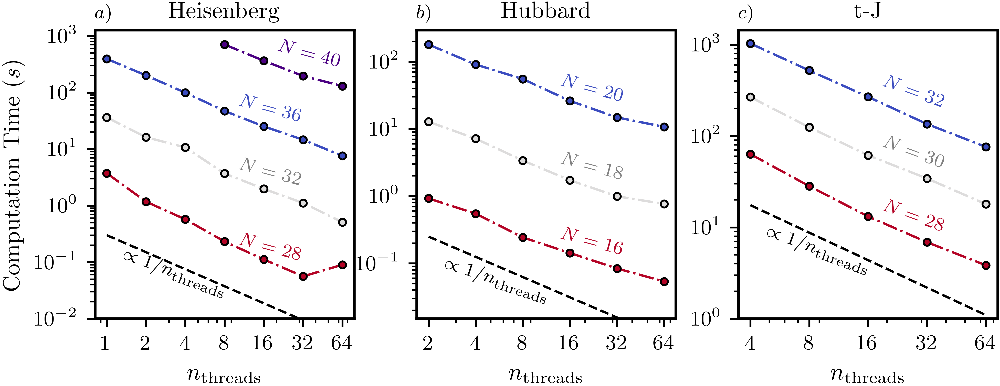

To properly highlight XDiag's paralellization performance, we benchmark the computation time of the key operation behind all main features implemented in XDiag: the execution of a single Lanczos iteration, consisting of a matrix-vector multiplication and a few vector operations. 

To evaluate performance across all Hilbert space types supported by XDiag—namely the [Spinhalf](documentation/blocks/spinhalf.md), [Electron](documentation/blocks/electron.md) and [tJ](documentation/blocks/tJ.md) blocks - we consider three distinct models:

1. The $S= 1/2$ one-dimensional Heisenberg chain with nearest-neighbor interactions,
   $$ H = J \sum_{\langle i,j\rangle} \mathbf{S}_i \cdot \mathbf{S}_j. $$
   
2. The one-dimensional Hubbard model,
   $$
   H = -t \sum_{\langle i,j\rangle, \; \sigma} \left(c^\dagger_{i,\sigma}c_{j,\sigma} + \text{h.c.} \right) + U \sum_{i=0}^{N} n_{i,\uparrow} n_{i,\downarrow}.
   $$

3. The *t*-*J* model of spin-$\frac{1}{2}$ electrons,
   $$
   H = -t \sum_{\langle i,j \rangle, \sigma} P \left( c^\dagger_{i,\sigma} c_{j,\sigma} + \text{h.c.} \right) P + J \sum_{\langle i , j \rangle } \mathbf{S}_i \cdot \mathbf{S}_j - n_i n_j/4. 
   $$

XDiag supports both multithreading with OpenMP and multiprocessing with MPI. We provide benchmarks for all three computational models using both parallelisation strategies. Please note that in the current version, MPI-based parallelisation does not support lattice symmetries. 

Throughout the following, all reported computation times refer to wall time, not CPU time.

## Shared memory parallelization

We demonstrate how the computation time for a single Lanczos step varies with the number of OpenMP threads used for shared-memory parallelisation. 

In addition to the U(1) symmetry—associated with the conservation of total magnetization in the Heisenberg model, or the conservation of total particle number in the Hubbard and *t*-*J* models— we also exploit lattice translation symmetries to perform the calculations (see [Symmetries](documentation/symmetries/representation.md)). 

Concrealy we consider:

- Heisenberg model: $N=28$, $N=32$, $N=36$ and $N=40$ at zero magnetization.
- Hubbard model: $N = 16$, $N = 18$, and $N = 20$ at half-filling.
- *t*-*J* model: $N=28$, $N=30$ and $N=32$ with two holes and at zero magnetization.

The benchmarks presented were performed on a single node equipped with an Intel Xeon® Platinum 8360Y (Ice Lake) 2.4 GHz processor.

**Figure**: Scaling of the computation time for a single Lanczos iteration as a function of the total number of threads used. The calculations were done for the Heisenberg (a), Hubbard (b), and *t*-*J* (c) models. The solid black line in each panel represents ideal linear scaling. U(1) and lattice symmetries were used in all cases.

In the figure above, we present the scaling of the computational time of a single Lanczos step with the total number of threads used. The time follows near-linear scaling with the number of OpenMP threads, decreasing with the inverse of the thread count.

### Table: Computation times with OpenMP (64 threads)

| Block      | N  | Symmetries          | Block Size              | Time (s)         |
|-------------|----|---------------------|-------------------------|------------------|
| [Spinhalf](documentation/blocks/spinhalf.md) | 40 | U(1) and Lattice    | $1.7 \cdot 10^{9}$      | $131 \pm 1$      |
| [Spinhalf](documentation/blocks/spinhalf.md) | 36 | U(1) and Lattice    | $1.3 \cdot 10^{8}$      | $7.60 \pm 0.2$   |
| [Spinhalf](documentation/blocks/spinhalf.md) | 32 | U(1) and Lattice    | $9.3 \cdot 10^{6}$      | $(5.1 \pm 0.1)\cdot 10^{-1}$ |
| [Spinhalf](documentation/blocks/spinhalf.md) | 28 | U(1) and Lattice    | $7.2 \cdot 10^{5}$      | $(9 \pm 2)\cdot 10^{-2}$     |
| [Electron](documentation/blocks/electron.md) | 22 | U(1) and Lattice    | $2.2 \cdot 10^{10}$     | $138 \pm 5$      |
| [Electron](documentation/blocks/electron.md) | 20 | U(1) and Lattice    | $1.0 \cdot 10^{9}$      | $10.9 \pm 0.1$   |
| [Electron](documentation/blocks/electron.md) | 18 | U(1) and Lattice    | $1.3 \cdot 10^{8}$      | $7.64 \pm 0.01$  |
| [Electron](documentation/blocks/electron.md) | 16 | U(1) and Lattice    | $1.0 \cdot 10^{7}$      | $5.37 \pm 0.01$  |
| [tJ](documentation/blocks/tJ.md) | 32 | U(1) and Lattice    | $2.0 \cdot 10^{9}$      | $75.9 \pm 0.1$   |
| [tJ](documentation/blocks/tJ.md) | 30 | U(1) and Lattice    | $5.8 \cdot 10^{8}$      | $17.95 \pm 0.05$ |
| [tJ](documentation/blocks/tJ.md) | 28 | U(1) and Lattice    | $1.4 \cdot 10^{8}$      | $3.84 \pm 0.02$  |

We can observe that the multithreading parallelization of XDiag exhibits close-to-linear scaling up to 64 threads.

## Distributed memory parallelization

**Figure**: Scaling of the computation time for a single Lanczos iteration as a function of the total number of MPI processes used. Calculations were done for Heisenberg (a), Hubbard (b), and *t*-*J* (c) models. Ideal linear scaling is shown as a reference.

XDiag also supports distributed-memory parallelization via MPI for the [SpinhalfDistributed](documentation/blocks/spinhalf_distributed.md), [ElectronDistributed](documentation/blocks/electron_distributed.md), and  [tJDistributed](documentation/blocks/tJ_distributed.md) blocks. Benchmarks were performed on the Max Planck Society's Raven supercomputer (Intel Xeon® Platinum 8360Y, HDR100 interconnect, 72 cores per node).

Only U(1) symmetries were used in these benchmarks, with the following parameters:

- Heisenberg model: $N=36$, $N=40$ and $N=42$ at zero magnetization.
- Hubbard model: $N=20$ (half-filling), $N=22$ and $N=24$ with $n_\uparrow = n_\downarrow = 8$.
- *t*-*J* model: $N=28$, $N=32$ with two holes and at zero magnetization.

### Table: Computation times with MPI

| Block       | N  | Symmetries | Block Size              | MPI Processes | Time (s)        |
|-------------|----|------------|--------------------------|----------------|-----------------|
| [Spinhalf](documentation/blocks/spinhalf_distributed.md)  | 42 | U(1)       | $5.4 \cdot 10^{11}$      | 18432          | $31.4 \pm 0.5$  |
| [Spinhalf](documentation/blocks/spinhalf_distributed.md)  | 40 | U(1)       | $1.4 \cdot 10^{11}$      | 18432          | $7.9 \pm 0.1$   |
| [Spinhalf](documentation/blocks/spinhalf_distributed.md)  | 36 | U(1)       | $9.0 \cdot 10^{9}$       | 2304           | $3.1 \pm 0.2$   |
| [Electron](documentation/blocks/electron_distributed.md) | 24 | U(1)       | $5.4 \cdot 10^{11}$      | 18432          | $21.0 \pm 0.2$  |
| [Electron](documentation/blocks/electron_distributed.md)  | 22 | U(1)       | $1.0 \cdot 10^{11}$      | 18432          | $4.3 \pm 0.1$   |
| [Electron](documentation/blocks/electron_distributed.md)  | 20 | U(1)       | $3.4 \cdot 10^{10}$      | 2304           | $7.7 \pm 0.5$   |
| [tJ](documentation/blocks/tJ_distributed.md)        | 32 | U(1)       | $7.6 \cdot 10^{10}$      | 4608           | $42.2 \pm 0.5$  |
| [tJ](documentation/blocks/tJ_distributed.md)        | 28 | U(1)       | $3.9 \cdot 10^{9}$       | 4608           | $2.3 \pm 0.4$   |

We observe that computation time scales nearly inversely with the number of MPI processes, demonstrating strong scaling up to several thousand processes.
