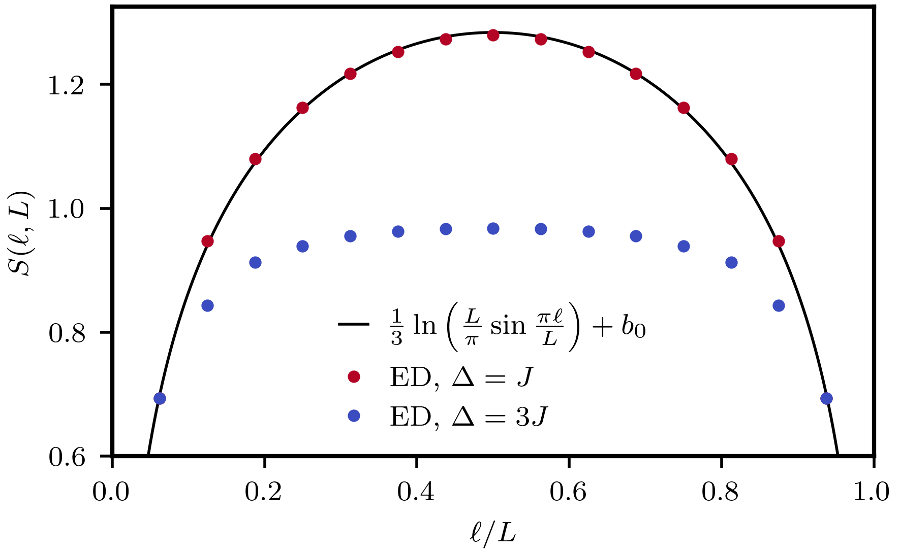
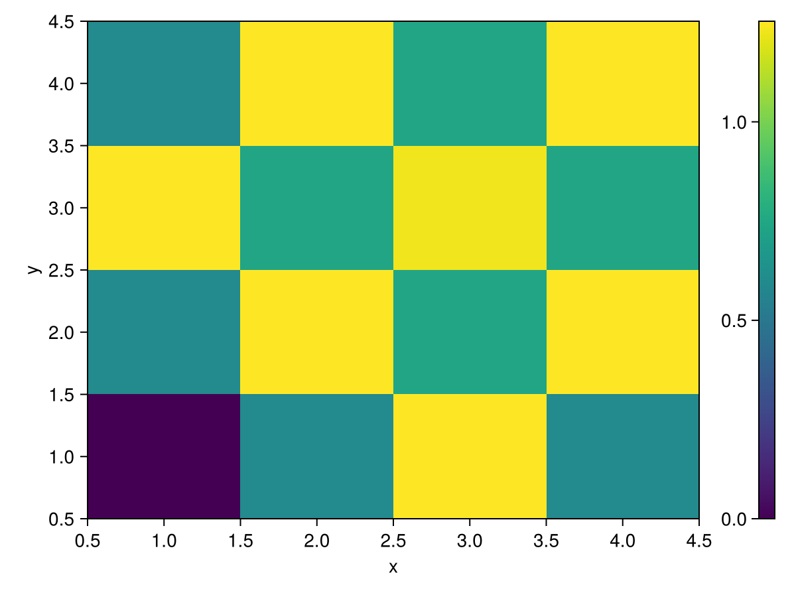
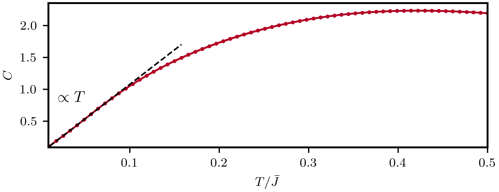
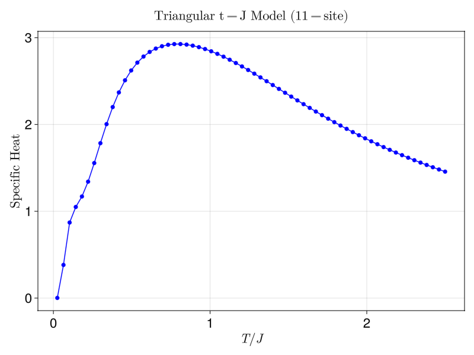
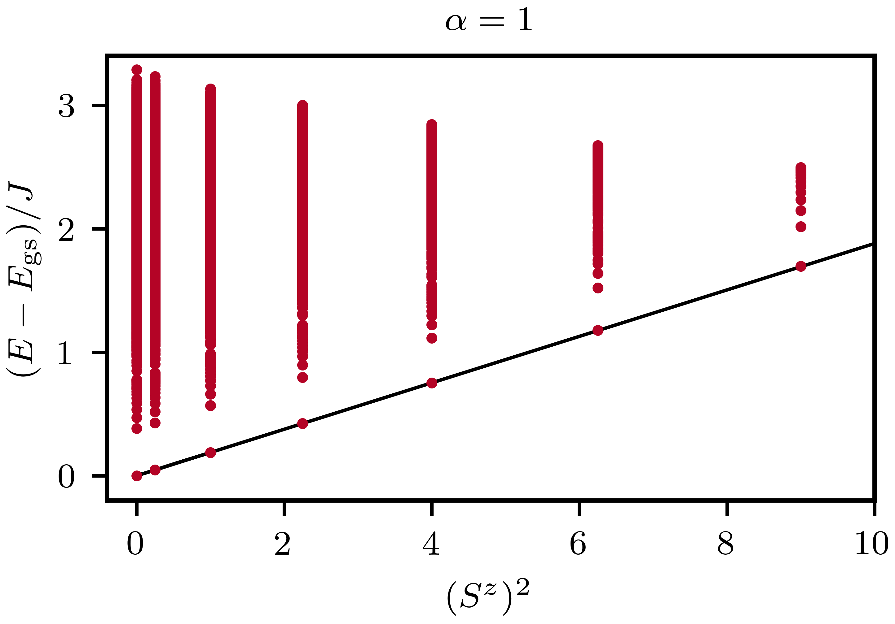
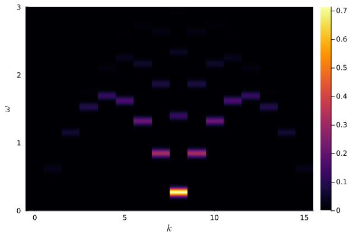
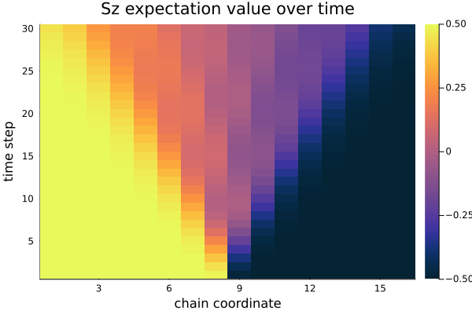

While we present core functionality in the [User Guide](user_guide.md), we here provide several examples along with XDiag to demonstrate how we can build more advanced applications from these basic building blocks. The examples are provided in the directory `examples` in the C++ source code directory, and can be compiled using CMake.

```bash
cmake -S . -B build -D BUILD_EXAMPLES=On
cmake --build build
```

The executables are then available in the directory `build/examples`. Most examples are also provided as a Julia script, and visualization scripts for the results are available.

## Ground states

<div class="grid cards" markdown>


-   :material-file-document:{ .lg .middle } __Ground state energy__

    ---

    Computes the ground state energy of a simple Heisenberg spin $S=1/2$ chain

    [source](examples/spinhalf_chain_e0.md) :simple-cplusplus: :simple-julia:


-  :material-file-document:{ .lg .middle } __Ground state correlators__

    ---

    Computes ground state correlators of a simple Heisenberg spin $S=1/2$ chain with the help of symmetries.

    [source](examples/spinhalf_chain_gs_corr_symmetries.md) :simple-cplusplus: :simple-julia: 


-  :material-file-document:{ .lg .middle } __Entanglement entropy ground state__

    ---

    Computes ground state entanglement entropy of an XXZ spin $S=1/2$ chain.

	{ align=center }

    [source](examples/entanglement_ground_state.md) :simple-cplusplus: :simple-julia: 

-  :material-file-document:{ .lg .middle } __CDW in attractive Hubbard model__

    ---

    Computes charge correlations in the ground state of the attractive 2D Hubbard model.

	{ align=center }

    [source](examples/ahm_correlations.md) :simple-cplusplus: :simple-julia: 


-  :material-file-document:{ .lg .middle } __Kitaev-Heisenberg honeycomb model__

    ---

    Computes the ground state of the Heisenberg-Kitaev model throughout its phase diagram

	{ align=center }

    [source](examples/gs_kitaev.md) :simple-cplusplus: :simple-julia: 


</div>

## Full exact diagonalization

<div class="grid cards" markdown>

-   :material-file-document:{ .lg .middle } __Specific heat random t-J model__

    ---

    Computes the specific heat of the random t-J model via full ED over multiple disorder realizations.
	
	{ align=center }

    [source](examples/specific_heat_randomtj.md) :simple-cplusplus: :simple-julia:

-   :material-file-document:{ .lg .middle } __Specific heat triangular t-J model__

    ---

    Computes the specific heat of the triangular t-J model via full ED.

	{ align=center }
	
    [source](examples/specific_heat_tJ_triangular.md) :simple-julia:

-   :material-file-document:{ .lg .middle } __Spin chain level statistics__

    ---

    Demonstrates Poissonian and Wigner-Dyson level statistics of integrable and non-integrable spin chains, respectively.
	
	{ align=center }

    [source](examples/spinhalf_chain_level_statistics.md) :simple-cplusplus: :simple-julia:

-   :material-file-document:{ .lg .middle } __Many-body localization__

    ---

    Studies hallmark diagonstics of a many-body localized system.
	
	{ align=center }

    [source](examples/mbl.md) :simple-cplusplus: :simple-julia:


</div>

## Tower of States

<div class="grid cards" markdown>

-   :material-file-document:{ .lg .middle } __TOS $\alpha \text{XX}$ chain__

    ---

    Performs a tower of states analysis for the $\alpha \text{XX}$ chain.
	
	{ align=center }

    [source](examples/tos_alpha_xx.md) :simple-cplusplus: :simple-julia:

-   :material-file-document:{ .lg .middle } __Heisenberg chain momentum resolved__

    ---

    Performs a (momentum) tower of states analysis for the antiferromagnetic chain.

	{ align=center }

    [source](examples/spinhalf_chain_TOS.md) :simple-cplusplus: :simple-julia:
  

-   :material-file-document:{ .lg .middle } __Square lattice Heisenberg model__

    ---

    Performs a tower of states analysis for the Heisenberg model in the square lattice.

	{ align=center }

	[source](examples/tos_square_Heisenberg.md) :simple-cplusplus:

-   :material-file-document:{ .lg .middle } __$J_1 - J_2$ model triangular lattice__

    ---

    Performs a tower of states analysis for the $J_1 - J_2$ model in the triangular lattice.

	{ align=center }

    [source](examples/tos_triangular.md) :simple-cplusplus: :simple-julia:
	

-   :material-file-document:{ .lg .middle } __$J_1 - J_2 - J_3$ Model in the kagome lattice__

    ---

    Performs a tower of states analysis for an extended kagome lattice Heisenberg antiferromagnet.

	

    [source](examples/tos_quad_kagome.md) :simple-cplusplus: :simple-julia:
	
-   :material-file-document:{ .lg .middle } __Attractive Hubbard model__

    ---

    Performs a tower of states analysis for the superconducting state in the attractive Hubbard model.
	_Ly(4).png){ align=center }

    [source](examples/tos_ahm.md) :simple-cplusplus: :simple-julia:
	
		
  
</div>


## Dynamical spectral functions

<div class="grid cards" markdown>

-   :material-file-document:{ .lg .middle } __Spin structure factor__

    ---

    Computes the dynamical spin structure factor of a spin $S=1/2$ chain

	{ align=center }

    [source](examples/spinhalf_chain_structure_factor.md) :simple-cplusplus: :simple-julia:

-   :material-file-document:{ .lg .middle } __Green's function__

    ---

    Computes the Green's function in a 2D Hubbard model

	{ align=center }

    [source](examples/hubbard_greens_f.md) :simple-cplusplus: :simple-julia:

    ---

-   :material-file-document:{ .lg .middle } __Optical conductivity__

    ---

    Computes the optical conductivity of one hole in a t-J model.

	{ align=center }

    [source](examples/tJ_conductivity.md) :simple-cplusplus: :simple-julia:

</div>

## Time Evolution

<div class="grid cards" markdown>

-   :material-file-document:{ .lg .middle } __Domain wall dynamics__

    ---

    Demonstrates the time evolution of a domain wall in the $S=1/2$ XXZ chain.
	{ align=center }

    [source](examples/spinhalf_chain_domain_wall_dynamics.md) :simple-cplusplus: :simple-julia:


-   :material-file-document:{ .lg .middle } __Slow quench__

    ---

    Demonstrates the implementation of slow quench in the $S=1/2$ Ising chain.

	

    [source](examples/slow_quench_Ising.md) :simple-julia:
	
	
-   :material-file-document:{ .lg .middle } __Hubbard interaction quench__

    ---

    Demonstrates the implementation of an interaction quench in the 2D Hubbard model.

	_Ly(3).png)

    [source](examples/ahm_quench.md) :simple-cplusplus: :simple-julia:


</div>


## Thermodynamics

<div class="grid cards" markdown>

-   :material-file-document:{ .lg .middle } __Specific heat Shastry-Sutherland__

    ---

    Computes the specific heat using the TPQ states (finite temperature Lanczos method) for the Shastry Sutherland model.

	{ align=center }

    [source](examples/tpq_shastry_sutherland.md) :simple-cplusplus: :simple-julia:
	
-   :material-file-document:{ .lg .middle } __Wilson ratio $J_1$-$J_2$ square lattice__

    ---

    Computes the Wilson ratio using the TPQ states (finite temperature Lanczos method) for the $J_1$-$J_2$ model on the square lattice

	


    [source](examples/square_J1_J2-WilsonRatio.md) :simple-cplusplus: :simple-julia:

</div>
