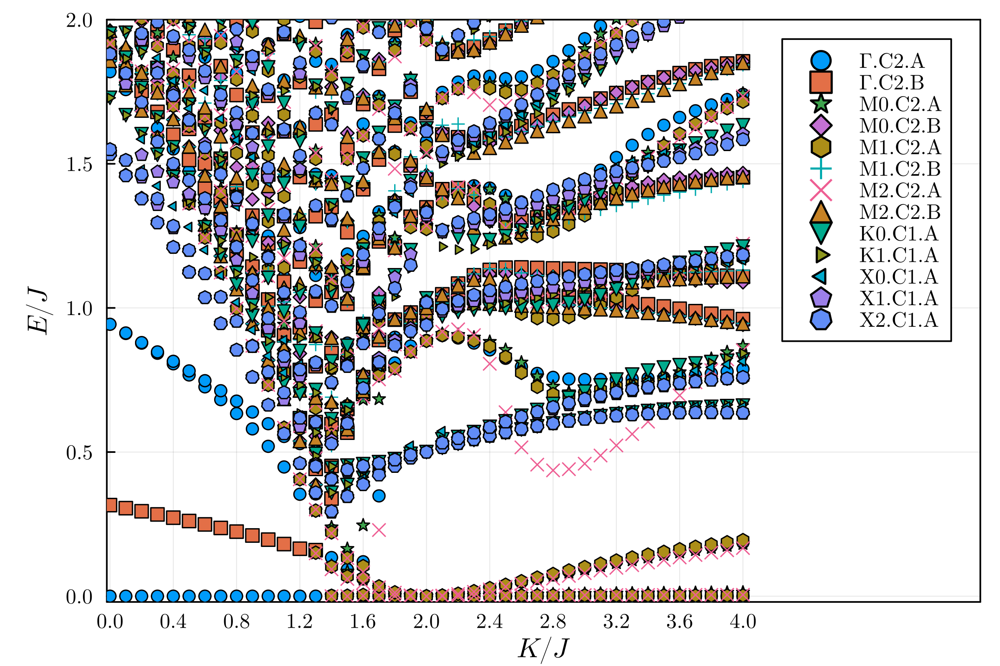

# Spectrum of Kitaev-Heisenberg model on a honeycomb lattice

We consider the Kitaev-Heisenberg model on a honeycomb lattice [[1]](#1). The Hamiltonian is given by

$$
\mathcal{H} = -K\sum_{\langle i,j\rangle \parallel \tilde{\gamma}} \boldsymbol{S}_i^\gamma \cdot \boldsymbol{S}_j^\gamma+J\sum_{\langle i,j\rangle} \boldsymbol{S}_i \cdot \boldsymbol{S}_j.
$$

where $\boldsymbol{S}_i$ are spin $1/2$ operators, $\langle \dots \rangle$ denotes sum over nearest and next-nearest neighbor sites, and in the first (Kitaev) term, when the nearest neighbor bonds are (anti)parallel to $\tilde{\gamma}=(0,1),(\sqrt{3},-1)/2,(-\sqrt{3},-1)/2$, $\gamma=x,y,z$, respectively. This model hosts Néel, stripy, zigzag, and ferromagnetic magnetic orders as well as Kitaev spin liquid phase depending on the parameter regimes [[2]](#2). 

Here, we will show how to obtain the low energy spectrum of this model using XDiag. Due to translation and $C_2$ rotation symmetry (note that this Hamiltonian does not possess $SU(2)$ or $S_z$ symmetry), the Hilbert space splits into different irreducible representation (irrep) sectors. We choose a system with $24$ sites ($12$ unit cells, such that all three $M$ points and $K$ and $K'$ points are accessible), and converge the lowest-lying eigenvalues in each of the irrep sector at each momentum point. We plot the spectrum $K/J$ in the figure below.



One can see in the figure above that there is a phase transition around $K/J\approx1.5$. For $K/J< 1.3$ the ground state is at $\Gamma$ point, whereas for $K/J> 1.7$, the ground states are at the $M$ points. The state for $K/J< 1.3$ is the Néel state, which is supported by the fact there are tower of states [[3]](#3) above the ground state. For $K/J>1.7$ the ground state has stripy order, which is why the ground state is at the $M$ point. Note that this model is exactly solvable at $K/J=2$ [[2]](#2), with ground state having stripy antiferromagnetic order [[1]](#1). However, remarkably, this stripy order, despite being antiferromagnetic, does not possess tower of states; or in other words, this state is fluctuation free. This is because at $K/J=2$, the model can be mapped to a Heisenberg model with ferromagnetic nearest neighbor coupling by rotating the spin operators in a particular way [[1]](#1).

The C++ script used to obtain the eigen spectra is given below

=== "C++"
	```c++
	--8<-- "examples/gs_kitaev_heisenberg_honeycomb/main.cpp"
	```

The interactions terms and the symmetry representation inputs are given in the following TOML file:

=== "toml"
	```toml
	--8<-- "examples/gs_kitaev_heisenberg_honeycomb/kitaev.24.toml"
	```

To run the above C++ code with the toml file, one needs to execute the following command 

``` bash
./build/main n_sites kname J KX KY KZ seed
```
where the n_sites, kname, J, KX, KY, KZ and seed are to be replaced by their values such as 24, Gamma.C2.A, 1.00, -1.00, -1.00, -1.00, 1, respectively. (Note that the code implements the possiblity of anisotropic Kitaev couplings with KX, KY and KZ taking different values. Furthermore, in the expression of the Hamiltonian above, we wrote the Kitaev term as ferromagnetic, but in the code it is implemented as antiferromagnetic, hence one needs to input negative values of KX, KY and KZ to obtain the results shown in the figure above.) The Julia code below was used to generate the plot above from the data obtaining running the above code.
	
Plotting Script

=== "Julia"
	```julia
	--8<-- "examples/gs_kitaev_heisenberg_honeycomb/plot2.jl"
	```


## References
<a id="1" href="https://journals.aps.org/prl/abstract/10.1103/PhysRevLett.105.027204">[1]</a>
Chaloupka, J., Jackeli, G., & Khaliullin, G. (2010). Kitaev-Heisenberg Model on a Honeycomb Lattice: Possible Exotic Phases in Iridium Oxides $\text{A}_2\text{IrO}_3$. Phys. Rev. Lett., 105(2), 027204.

<a id="2" href="https://journals.aps.org/prb/abstract/10.1103/PhysRevB.95.024426">[2]</a>
Gotfryd, D., Rusnačko, J., Wohlfeld, K., Jackeli, G., Chaloupka, J., & Oleś, A. M. (2017). Phase diagram and spin correlations of the Kitaev-Heisenberg model: Importance of quantum effects. Physical Review B, 95(2), 024426.

<a id="3" href="https://journals.aps.org/pr/abstract/10.1103/PhysRev.86.694">[3]</a>
P. W. Anderson, An Approximate Quantum Theory of the Antiferromagnetic Ground State, Phys. Rev. 86, 694 (1952)
