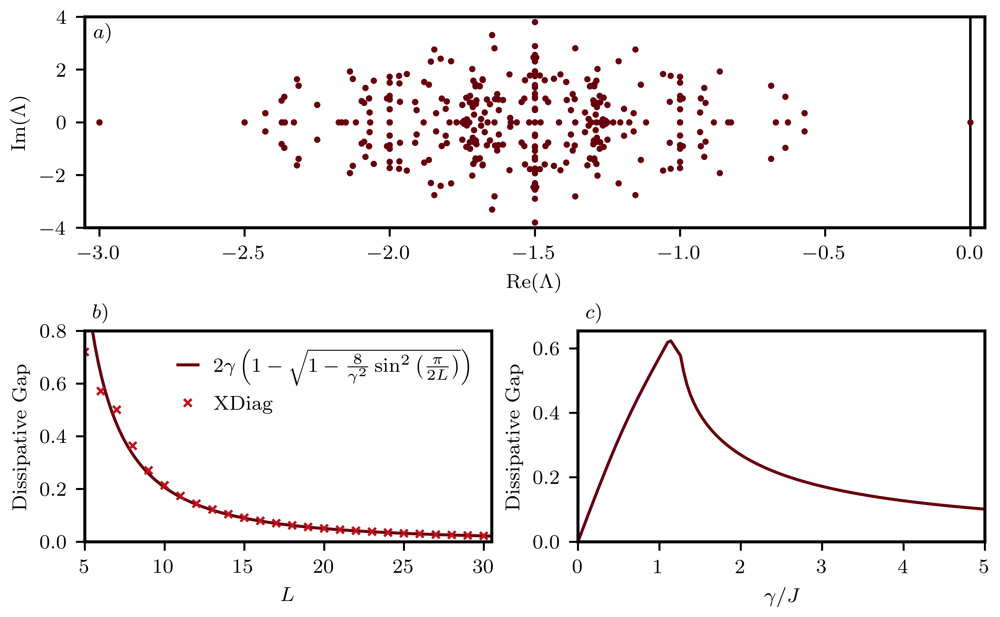

# Spectrum of the Linblad Super Operator

In the study of Markovian open quantum systems, the time-evolution of the system density matrix can, in many interesting scenarios, be given by a master equation in Lindblad form:

$$
\frac{d \rho}{dt} = -i[H,\rho] + \sum_{\mu} \left( L_{\mu} \rho L^\dagger_{\mu} - \frac{1}{2} \{L^\dagger_\mu L_\mu, \rho \} \right),
$$

where $\rho$ is the system density matrix, $L_\mu$ is a quantum jump operator representing a dissipative process, and $H$ is the system's Hamiltonian, responsible for generating the coherent part of the dynamics.

The Lindblad spectrum reveals the system's excitations and decay timescales. A key feature is the dissipative gap (the absolute real part of the eigenvalue closest to zero) which determines the slowest relaxation time and signals dissipative phase transitions [[1](#1),[2](#2)]. In this example, we use XDiag to compute the full spectrum of the Linblad superoperator corresponding to a Heisenberg XXZ chain with bulk dephasing.

The system evolves under the Hamiltonian $\mathcal{H}$ and dephasing jump operators $L_{n}$:

$$
\mathcal{H} = J \sum_{n} \left( S^+_n S^-_{n+1} + S^+_{n+1} S^-_{n} + \Delta S^z_n S^z_{n+1} \right), \quad L_{n} = \sqrt{\gamma} S^z_n,
$$

where $J$ is the exchange constant and $\gamma$ is the dissipation strength.

To diagonalize this in XDiag, we first write the Lindblad superoperator by vectorizing the density matrices using the Choi isomorphism:

$$
\rho = \sum_{i,j} \rho_{i,j} |i\rangle \langle j| \rightarrow |\rho\rangle\rangle = \sum_{i,j} \rho_{i,j} |i\rangle \otimes |j\rangle.
$$

This introduces an auxiliary spin chain $\tilde{S}$ acting on the "bra" degrees of freedom. The resulting non-Hermitian operator is:

$$
\mathcal{L} =\sum_{n=0}^{L-1} \left\{  -iJ \left( S_{n}^{+}S_{n+1}^{-} + S_{n+1}^{+}S_{n}^{-} + \Delta S_{n}^{z}S_{n+1}^{z}  \right) + iJ \left( \tilde{S}_{n}^{+}\tilde{S}_{n+1}^{-} + \tilde{S}_{n+1}^{+}\tilde{S}_{n}^{-} + \Delta\tilde{S}_{n}^{z}\tilde{S}_{n+1}^{z}  \right) + \gamma  S_{n}^{z}\tilde{S}_{n}^{z} \right\} -i\frac{\gamma}{4}L.
$$

The former operator can be constructed in XDiag as a single OpSum (note that XDiag automatically applies Hermitian conjugation when using certain built-in operators).

{ align=center }

As the system possesses strong U(1) symmetry ($[S^z, \mathcal{H}] = [S^z, L_\mu] = 0$), we can diagonalize the Liouvillian within sectors of well-defined magnetization and obtain the spectrum and the dissipative gap. The figure above presente these results for $\Delta=0$: $a)$ Linblad spectrum for $S^z=0$, $\gamma =2.0J$ and $L=6$, $b)$ the dissipative gap in the one-body sector as a function of system size for $\gamma=2.0J$, compared with the analytical result [[3]](#3) (valid for sizes greater than the critical size); and $c)$ the dissipative gap in the $S^z=0$ sector as function of the disspation strength for $L=6$.

=== "C++"
	```c++
	--8<-- "examples/linblad/main.cpp"
	```

=== "Julia"
	```julia
	--8<-- "examples/linblad/main.jl"
	```
	
## references
<a id="1" href="https://journals.aps.org/pra/abstract/10.1103/PhysRevA.98.042118">[1]</a>
Fabrizio Minganti, Alberto Biella, Nicola Bartolo, and Cristiano Ciuti, Physical Review A 98, 042118 (2018)

<a id="2" href="https://arxiv.org/abs/2505.15711">[2]</a>
Rafael D. Soares, Matteo Brunelli and Marco Schirò, arXiv:2505.15711 (2025)

<a id="3" href="https://journals.aps.org/pre/abstract/10.1103/PhysRevE.92.042143">[3]</a>
Marko Žnidarič, Physical Review E 92, 042143 (2015)