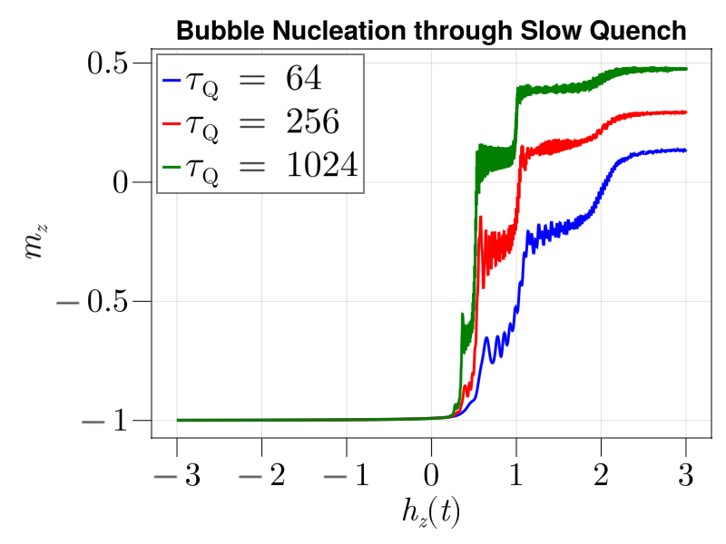

# Bubble Nucleation in the 1D Quantum Ising Chain

We study a one-dimensional quantum Ising chain in the presence of both **transverse** ($h_x$) and **longitudinal** ($h_z$) fields. This system exhibits a first-order quantum phase transition (FOQPT) between two symmetry-broken ferromagnetic phases with opposite longitudinal magnetization.

When the longitudinal field is slowly ramped from negative to positive values across the FOQPT, the system undergoes **quantized bubble nucleation** events [[1]](#1): sharp nonadiabatic transitions in the dynamics where local domains (or “bubbles”) of the new vacuum appear within the metastable phase. Each such nucleation corresponds to an $n$-spin bubble becoming degenerate with the initial state, and the tunneling between them is mediated via an $n$-th order process in $h_x$. These events can be accurately described using Landau-Zener theory near each resonance point.

## The Model

We consider the Hamiltonian:

$$
\mathcal{H} =
  - \sum_{n=1}^{N-1} \sigma^z_n \sigma^z_{n+1}
  - h_x \sum_{n=1}^{N} \sigma^x_n
  - h_z(t) \sum_{n=1}^{N} \sigma^z_n,
$$

where:
- $\sigma^x$, $\sigma^z$ are Pauli matrices,
- $h_x$ introduces quantum fluctuations,
- $h_z(t) = h_z^{\text{in}} + t/\tau_Q$ is the time-dependent longitudinal field.

The FOQPT separates the $\langle \sigma^z \rangle < 0$ and $\langle \sigma^z \rangle > 0$ ferromagnetic phases. The dynamics is initiated in the ground state at $h_z = h_z^{\text{in}} < 0$, and the field is ramped linearly to $h_z^{\text{fin}} > 0$.

## Simulation Overview

The Julia code in `main.jl` performs the following steps:

1. **Initialize** a chain of length $N = 8$ with a transverse field $h_x = 0.2$.
2. **Prepare** the initial state by computing the ground state at $h_z = -3$ using exact diagonalization (`eig0`).
3. **Evolve** the system in real time with time steps $\Delta t = 0.05$, using `time_evolve`, while slowly increasing $h_z(t)$ across the FOQPT.
4. **Measure** the longitudinal magnetization $m_z(t) = \langle \sigma^z \rangle$ at each step.
5. **Plot** the results of the magnetization dynamics for multiple quench rates $\tau_Q \in \{64, 256, 1024\}$.

The plot below demonstrates distinct jumps in magnetization at characteristic values of $h_z$, consistent with quantized bubble nucleation and higher-order tunneling events.



## Code

=== "Julia"
```julia
--8<-- "examples/slow_quench_Ising/main.jl"
```

## references
<a id="1" href="https://journals.aps.org/prb/abstract/10.1103/PhysRevB.103.L220302">[1]</a> 
Aritra Sinha, Titas Chanda, and Jacek Dziarmaga  
*Nonadiabatic dynamics across a first-order quantum phase transition: Quantized bubble nucleation*,  
Phys. Rev. B **103**, L220302 (2021).

