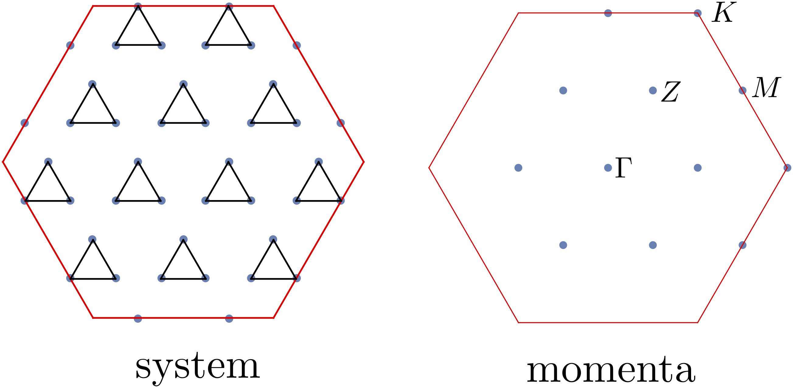

# Extended kagome lattice antiferromagnet

**Author** Siddhartha Sarkar

We consider kagome lattice with the following Hamiltonian

$$
\mathcal{H} = J_1\sum_{\langle i,j\rangle} \boldsymbol{S}_i \cdot \boldsymbol{S}_j+J_2\sum_{\langle \langle i,j\rangle\rangle} \boldsymbol{S}_i \cdot \boldsymbol{S}_j+J_3\sum_{\langle \langle\langle i,j\rangle\rangle\rangle_h} \boldsymbol{S}_i \cdot \boldsymbol{S}_j.
$$

where $\boldsymbol{S}_i$ are spin $1/2$ operators, $\langle \dots \rangle$ and $\langle\langle \dots \rangle\rangle$ denote sum over nearest and next-nearest neighbor sites, and $\langle \langle\langle\dots\rangle\rangle\rangle_h$ denote sum over third-nearest-neighbor sites [[2]](#2). This model host plethora of interesting phases for different parameter regimes. Here we we will be interested in the parameter values $J_2/J_1 =-1.0$ and $J_3/J_1=-2.0$, for which it was predicted in [[2]](#2) that the ground state has spin-nematic character, of quadrupolar type. Tower of state analysis [[1]](#1) provides a strong evidence for this type of spontaneous symmetry breaking (SSB) in the thermodynamic limit, as the ground state of a finite system is completely symmetric. The spectrum of this model can be labeled by total magnetization since $[\mathcal{H},S_z]=0$ (in fact the Hamiltonian is $SU(2)$, and hence the spectrum can be labeled by $S^2$ and $S_z$; but for obtaining the eigen-spectrum, we only use $S_z$).

To perform the TOS analysis, we converged the lowest-lying eigenvalues using the Lanczos algorithm in each symmetry sector (labeled by $S_z$, momentum, and little group irreducible representations at each momentum) for a $C_6$ symmetric system with $N=36$ sites ($12$ unit cells and $3$ spins per unit cell). The $36$-site kagome lattice and the momentum points in the Brillouin zone are shown in the figure below.


In the left figure above, the twelve triangles show the 12 unit cells. In the right figure above, the different momentum points are shown; there are three $M$ points (related by $C_3$ with each other), two $K$ points (related by $C_2$), six $Z$ points (related by $C_6$), and one $\Gamma$ point. We plot the spectrum vs $S_z$ in the figure below.


The momenta and the irrep labels of the eigenstates are shown with markers. The degeneracies at different $S_z$ gives total quantum of number $S$. Odd-$S$ sectors are not present in the low-energy tower of states, indicating a quadrupolar spin-nematic phase [[2]](#2).

The C++ script used to obtain the eigen spectra is given below

=== "C++"
	```c++
	--8<-- "examples/tos_quad_kagpme/main.cpp"
	```

The interactions terms and the symmetry representation inputs are given in the following TOML file:

=== "toml"
	```toml
	--8<-- "examples/tos_quad_kagpme/kagome.36.J1J2J3.pbc.toml"
	```

To run the above C++ code with the toml file, one needs to execute the following command 

``` bash
./build/main n_sites n_up kname J1 J2 J3 seed
```
where the n_sites, n_up, kname, J1, and seed are to be replaced by their values such as 32, 16, Gamma.C6.A, 1.00, -1.00, -2.00, 1, respectively. The Julia code below was used to generate the plot above from the data obtaining running the above code.
	
Plotting Script

=== "Julia"
	```julia
	--8<-- "examples/tos_quad_kagome/plot2.jl"
	```


## references
<a id="1" href="https://journals.aps.org/pr/abstract/10.1103/PhysRev.86.694">[1]</a>
P. W. Anderson, An Approximate Quantum Theory of the Antiferromagnetic Ground State, Phys. Rev. 86, 694 (1952)

<a id="2" href="https://journals.aps.org/prb/abstract/10.1103/PhysRevB.102.020411">[2]</a>
Wietek, Alexander, and Andreas M. Läuchli. "Valence bond solid and possible deconfined quantum criticality in an extended kagome lattice Heisenberg antiferromagnet." Physical Review B 102.2 (2020): 020411
