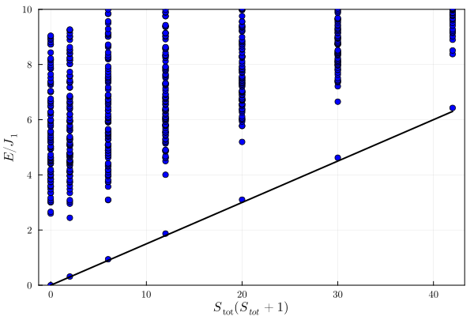

# TOS Heisenberg model on a square lattice

We perform a tower of states (TOS) analysis [[1]](#1) of the Heisenberg model on a square lattice under periodic boundary condition. This model consists of spin-$\frac{1}{2}$ sites at the vertices of square lattice with nearest-neighbor antiferromagnetic Heisenberg couplings such that the Hamiltonian has the form

$$
\mathcal{H} = J\sum_{\langle i,j\rangle} \boldsymbol{S}_i \cdot \boldsymbol{S}_j
$$

The TOS analysis provides strong evidence for spontaneous symmetry breaking (SSB) in the thermodynamic limit, as the ground state of a finite system is completely symmetric. The spectrum of this model can be labeled by total magnetization since $[\mathcal{H},S_z]=0$ (in fact the Hamiltonian is $SU(2)$, and hence the spectrum can be labeled by $S^2$ and $S_z$; but for obtaining the eigen-spectrum, we only use $S_z$).

To perform the TOS analysis, we converged the lowest-lying eigenvalues using the Lanczos algorithm in each symmetry sector. We then determined the total spin quantum number, $S_{\text{tot}}$, by inspecting, for each energy level, the number of degenerate eigenstates; thus, $S_{\text{tot}}$ is given by the maximum $S_z$. Finally, we plotted the energy spectra as a function of $S_{\text{tot}}\left(S_{\text{tot}} + 1\right)$. 

{ align=center }

In the figure above, we show the energy spectra as a function of $\(S_{\text{tot}}\left(S_{\text{tot}} + 1\right)\)$ for a system of $N=32$ sites. In this case, the ground state exhibits a Néel order.

=== "C++"
	```c++
	--8<-- "examples/tos_square_Heisenberg/main.cpp"
	```

The interactions terms and the symmetry representation inputs are given in the following TOML file:
=== "toml"
	```toml
	--8<-- "examples/tos_square_Heisenberg/square.32.J1.fsl.pbc.toml"
	```


To run the above C++ code with the toml file below, one needs to execute the following command 

``` bash
./build/main n_sites n_up kname J1 seed
```
where the n_sites, n_up, kname, J1, and seed are to be replaced by their values such as 32, 16, Gamma.C4.A, 1.00, 1, respectively. The Julia code below was used to generate the plot above from the data obtaining running the above code.
	
Plotting Script
=== "Julia"
	```julia
	--8<-- "examples/tos_square_Heisenberg/plot.jl"
	```


## references
<a id="1" href="https://journals.aps.org/pr/abstract/10.1103/PhysRev.86.694">[1]</a>
P. W. Anderson, An Approximate Quantum Theory of the Antiferromagnetic Ground State, Phys. Rev. 86, 694 (1952)