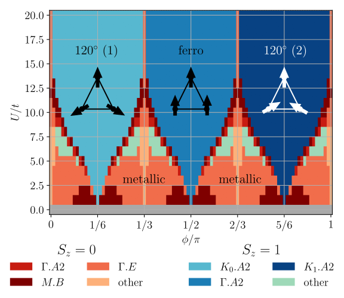
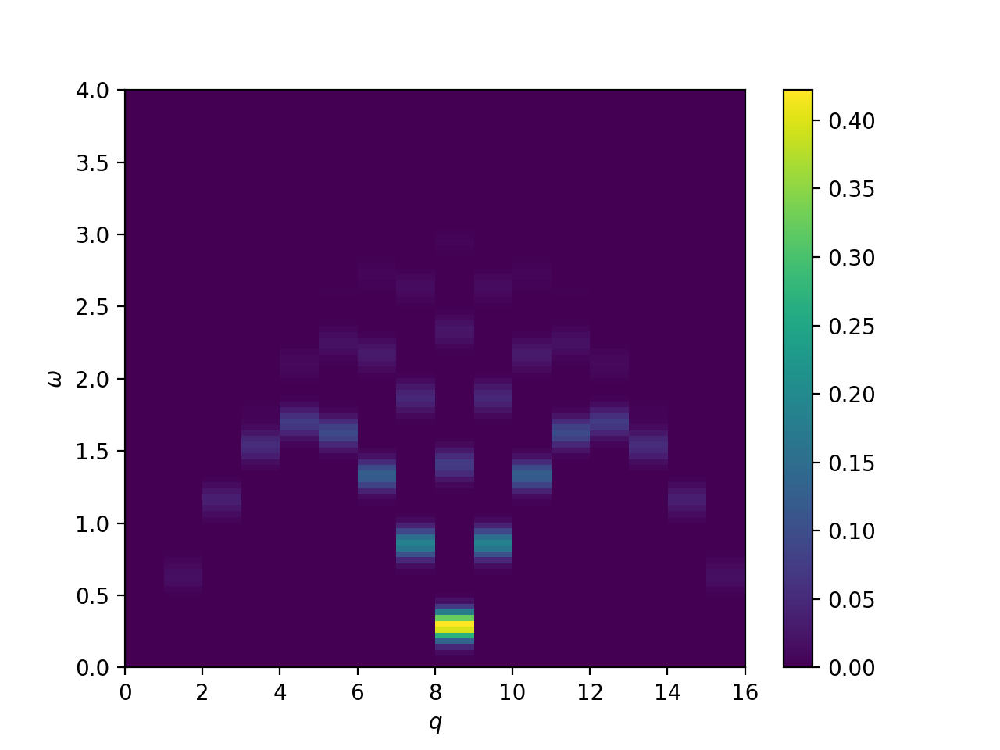
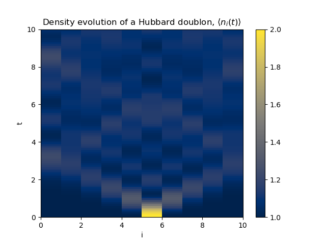
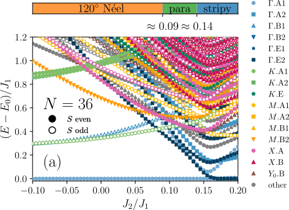

[](https://github.com/awietek/xdiag/actions/workflows/linux.yml)
[](https://github.com/awietek/xdiag/actions/workflows/osx.yml)
[](https://github.com/awietek/xdiag/actions/workflows/intelmpi.yml)
[](https://github.com/awietek/XDiag.jl/actions/workflows/CI.yml)


[Quick Start](quick_start.md){ .md-button .md-button--primary }
[Code on GitHub](https://github.com/awietek/xdiag){ .md-button .md-button--secondary }

## Overview
XDiag is a library for performing Exact Diagonalizations of
quantum many-body systems. Key features include optimized combinatorical
algorithms for navigating Hilbert spaces, iterative linear algebra algorithms,
 shared and distributed memory parallelization. It consist of two packages:
 
* The core C++ library [xdiag](https://github.com/awietek/xdiag)
* The convenient Julia wrapper library [XDiag.jl](https://github.com/awietek/XDiag.jl)


## Citation
Please support our work by citing XDiag and the implemented algorithms if it is used in your published research.

```bibtex
@article{Wietek2018,
  title = {Sublattice coding algorithm and distributed memory parallelization for large-scale exact diagonalizations of quantum many-body systems},
  author = {Wietek, Alexander and L\"auchli, Andreas M.},
  journal = {Phys. Rev. E},
  volume = {98},
  issue = {3},
  pages = {033309},
  numpages = {10},
  year = {2018},
  month = {Sep},
  publisher = {American Physical Society},
  doi = {10.1103/PhysRevE.98.033309},
  url = {https://link.aps.org/doi/10.1103/PhysRevE.98.033309}
}

```


## Gallery
<div class="grid cards" markdown>
- { align=left }
- { align=left }
- { align=left }
- { align=left }
</div>
