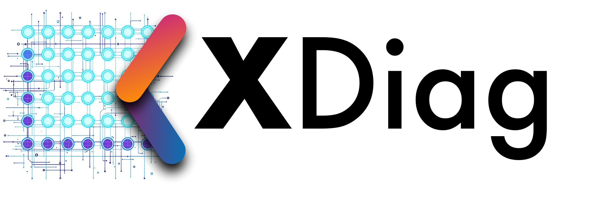
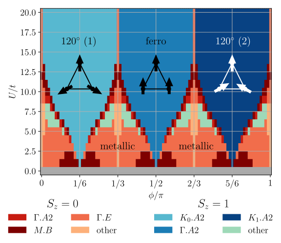
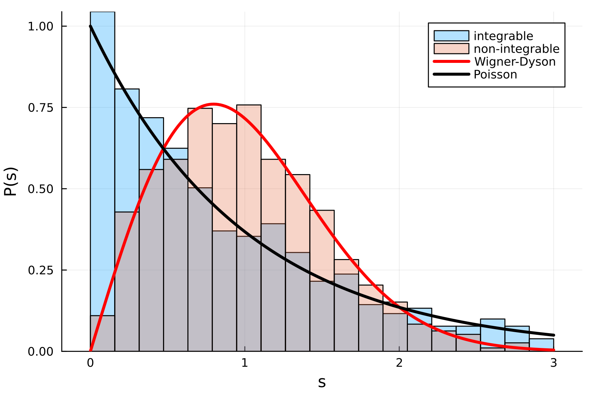
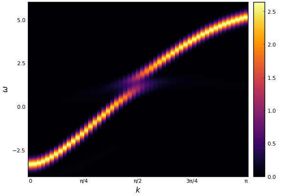
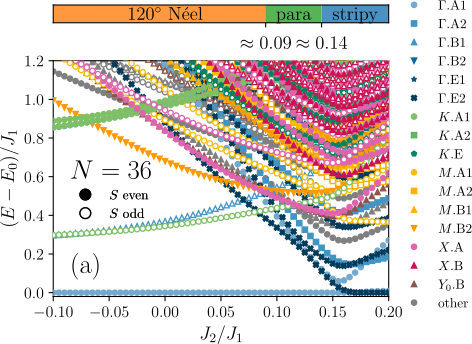

**Exact Diagonalization of quantum many-body systems — in Julia and C++.**

[Quick Start](quick_start.md){ .md-button .md-button--primary }
[User Guide](user_guide/index.md){ .md-button .md-button--secondary }
[Publications using XDiag](publications.md){ .md-button .md-button--secondary }

| Languages                                                                                                                                                                                                      | Code status                                                                                                                                                                                                                                                                                                                                                                                                                                                                                                                                                                                                                                                                                                                                                                                                                                                                                                                                                                                                                                                                                                                                                                                         |               Version |
|:---------------------------------------------------------------------------------------------------------------------------------------------------------------------------------------------------------------|-----------------------------------------------------------------------------------------------------------------------------------------------------------------------------------------------------------------------------------------------------------------------------------------------------------------------------------------------------------------------------------------------------------------------------------------------------------------------------------------------------------------------------------------------------------------------------------------------------------------------------------------------------------------------------------------------------------------------------------------------------------------------------------------------------------------------------------------------------------------------------------------------------------------------------------------------------------------------------------------------------------------------------------------------------------------------------------------------------------------------------------------------------------------------------------------------------|----------------------:|
|   |      | [v0.5.0](releases.md) |

## Overview

XDiag is a library for performing **exact diagonalizations** of quantum many-body systems. It is designed to be both easy to use and highly performant, and consists of two packages that share a common API:

* the core C++ library [xdiag](https://github.com/awietek/xdiag), and
* the convenient Julia wrapper [XDiag.jl](https://github.com/awietek/XDiag.jl).

Key features:

* **Many Hilbert space types** — spins, electrons, $t$-$J$ models, spinless fermions, and bosons.
* **A full operator algebra** — assemble arbitrary operators and multiply or hermitian-conjugate them freely.
* **Iterative algorithms** — Lanczos and LOBPCG diagonalization, and real- or imaginary-time evolution.
* **Symmetries** — exploit space-group symmetries through symmetry-adapted bases.
* **Parallelization** — shared-memory with OpenMP and distributed-memory with MPI.
* **Optimized combinatorics** for fast navigation of large Hilbert spaces.

## News
* **Jul. 30, 2026** — New **major** release [v0.5.0](releases.md): a generic operator algebra, spinless-fermion and boson blocks, an LOBPCG eigensolver, and improved memory efficiency.
* **Dec. 4, 2025** — New release [v0.4.1](releases.md) fixes a bug reported as issue #99.
* **Nov. 4, 2025** — New release [v0.4.0](releases.md) introduces sparse matrix capabilities.
* **Jun. 17, 2025** — New release [v0.3.3](releases.md) features additional parallelization in Julia, compatibility with Julia 1.12, and several practical enhancements.

## Gallery

A few results produced with XDiag:

- { align=left }
- { align=left }
- { align=left }
- { align=left }

