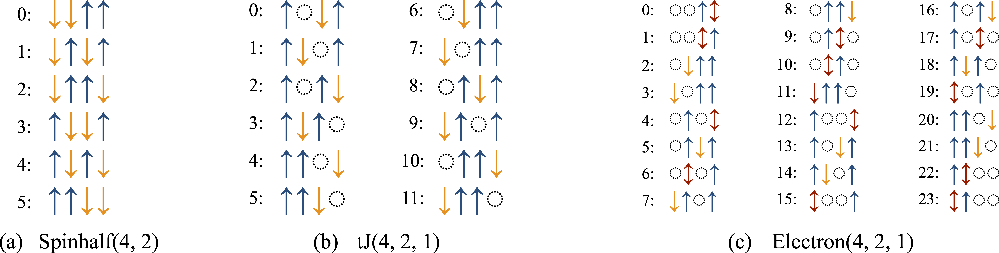
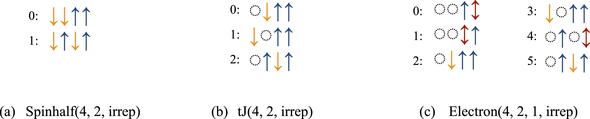

**A step-by-step guide to using XDiag**


## Installation


### Julia library

XDiag can conveniently be installed via the Julia package manager. First, a Julia interpreter needs to be opened from a command line using `julia`. Then, the "package mode" can be entered by typing `]`, and XDiag is installed using `add XDiag`. In summary:

=== "Bash"
	```bash
	$ julia
	julia> ]
	pkg> add XDiag
	```

---

### C++ library

The first step in employing the C++ version is to compile the library. The source code can be obtained from [github](https://github.com/awietek/xdiag) by cloning using [git](https://git-scm.com/).

=== "Bash"
	```bash
	cd /path/to/where/xdiag/should/be
	git clone https://github.com/awietek/xdiag.git
	```

The compilation and installation is then performed with [CMake](https://cmake.org/) 

=== "Bash"
	```bash
	cd xdiag
	cmake -S . -B build
	cmake --build build
	cmake --install build
	```

By default, the resulting library is installed at `/path/to/where/xdiag/should/be/install`. There are various options when compiling, including optimizations that can be used. For more details on the compilation process, we refer to the [compilation guide](documentation/compilation/compilation.md).

---

### Writing application code

To employ the XDiag library, an application code is written. The simplest application using XDiag is a `hello_world` program.

=== "C++"
	```c++ 
	--8<-- "examples/hello_world/main.cpp"
	```
=== "Julia"
	```julia 
	--8<-- "examples/hello_world/main.jl"
	```

The function `say_hello()` prints out a welcome message, which also contains information on which exact XDiag version is used. We would like to emphasize the `try / catch` block in the C++ version. XDiag implements a traceback mechanism for runtime errors, which is activated by the `error_trace` function. While not strictly necessary here, it is a good practice to employ this.

---

### Application compilation

In C++, now that the application program is written, we next need to set up the compilation instructions using [CMake](https://cmake.org/). To do so we create a second file called `CMakeLists.txt` in the same directory.

=== "CMake"
	```cmake
	--8<-- "examples/hello_world/CMakeLists.txt"
	```

You should replace `/path/to/where/xdiag/should/be/install` with the appropriate directory where your XDiag library is installed after compilation. We then compile the application code,

=== "Bash"
	```bash
	cmake -S . -B build
	cmake --build build
	```
and finally run our first XDiag application.

=== "Bash"
	```bash
	./build/main
	```

---

## Usage Guide

After installation or library compilation, the user is ready to run the first calculation using XDiag. For the purpose of this usage guide, our immediate goal is to determine the ground state energy of a $S=1 / 2$ Heisenberg model on a 1D chain lattice with periodic boundary conditions,

$$ H=J \sum_{\langle i, j\rangle} \mathbf{S}_{i} \cdot \mathbf{S}_{j}, $$

where $\mathbf{S}_{i}=\left(S_{i}^{x}, S_{i}^{y}, S_{i}^{z}\right)$ denotes the vector of spin matrices at a given site $i$. The notation $\langle i, j\rangle$ refers to summation over neighboring sites $i$ and $j$. In the following, we will discuss how to set up such a calculation and give an overview of further functionality in XDiag.


### Hilbert spaces

The first thing to define before any computation is the Hilbert space our model will be defined on. For this, we create an object of type [Spinhalf](documentation/blocks/spinhalf.md) and hand as an argument the number of physical sites $N$.

=== "C++"
	```c++ 
	--8<-- "examples/user_guide/main.cpp:usage_guide_hs1"
	```
=== "Julia"
	```julia 
	--8<-- "examples/user_guide/main.jl:usage_guide_hs1"
	```
	
We would like to know which spin configurations the Hilbert space is made up of. To do so, we can iterate over the Hilbert space and print out the configurations and the total Hilbert space dimension.


=== "C++"
	```c++ 
	--8<-- "examples/user_guide/main.cpp:usage_guide_hs2"
	```
=== "Julia"
	```julia 
	--8<-- "examples/user_guide/main.jl:usage_guide_hs2"
	```


XDiag features a convenient way to write logs in C++, with the [Log](documentation/utilities/logging.md) class. The first argument to `Log()` is a format string. In C++ we use the [fmt library](https://fmt.dev/) to be able to write formatted output. The second argument turns our spins into a string. `spins` is of type [ProductState](documentation/states/product_state.md), whose configuration on each site can be individually addressed by using the `[]` operator. The opposite task of computing the index of a given `ProductState` within the block basis can be addressed using the `index` function. An important difference between C++ and Julia is that indices are counted starting from `0` in C++ and `1` in Julia. Hence, also in the above code snippet, the C++ version will start counting the indices from `0` and Julia from `1`.

The precise output depends on which Hilbert space is chosen. At present, XDiag features three distinct types of Hilbert spaces:

* [Spinhalf](documentation/blocks/spinhalf.md): $S=1/2$ spins; each site is either occupied by an $\uparrow$-spin or a $\downarrow$-spin.
* [Electron](documentation/blocks/electron.md): spin $S=1/2$ electrons; each site is either empty $\emptyset$, occupied by an $\uparrow$-spin or $\downarrow$-spin electron, or is doubly occupied $\updownarrow$.
* [tJ](documentation/blocks/tJ.md): spin $S=1/2$ electrons without double occupancies; each site is either empty $\emptyset$, occupied by an $\uparrow$-spin or $\downarrow$-spin electron.

Frequently, many-body systems feature certain symmetries and conservation laws. Common conservation laws include particle number, spin, or momentum conservation. The Hilbert space can then be subdivided into blocks, which are labeled by the respective conserved quantities. Blocks of a Hilbert space with a given particle number can be easily created by handing further arguments when constructing the Hilbert space specifying the particle numbers. The number of $\uparrow$-spins in a [Spinhalf](documentation/blocks/spinhalf.md) block can be specified via,

=== "C++"
	```c++ 
	--8<-- "examples/user_guide/main.cpp:usage_guide_hs3"
	```
=== "Julia"
	```julia 
	--8<-- "examples/user_guide/main.jl:usage_guide_hs3"
	```	

The result of printing out the configurations of specific blocks is shown in the [figure below](#fig-fix-block). This enumeration is important to interpret coefficients of wave functions. By printing out the basis states of spin configurations, the user can also assess how computational basis states are ordered internally in XDiag.


{#fig-fix-block}

---

### Operators

Besides Hilbert spaces, the second key objects in quantum mechanics are operators. In a many-body setting, we consider operators of the form,
$$
	O = \sum_{A\subseteq \mathcal{L}} c_A O_A,
$$
where $O_A$ denotes a local operator acting on sites $A=\{a_1, \ldots, a_{l_A}\}$ and $\mathcal{L}$ denotes the lattice and $c_{A}$ are coupling constants. In the case of the Heisenberg model, we would thus have $\mathcal{O}_{A} = \mathbf{S}_i\cdot\mathbf{S}_j$ and $c_A = J$. In XDiag, the local operators are represented via an [Op](documentation/operators/op.md) object while the sum is represented by an [OpSum](documentation/operators/opsum.md) object. These values of the coupling constants $c_A$ can either be a real or complex number, or a string that later needs to be replaced. The Hamiltonian of a spin $S=1 / 2$ Heisenberg chain is created in the following way:

=== "C++"
	```c++ 
	--8<-- "examples/user_guide/main.cpp:usage_guide_op1"
	```
	
=== "Julia"
	```julia 
	--8<-- "examples/user_guide/main.jl:usage_guide_op1"
	```

We first create an empty [OpSum](documentation/operators/opsum.md) and then add additional terms to it. The first part of the product denotes the coupling constant, here given as a string. Alternatively, one could have directly used real / complex numbers here. The second part of the product is a single [Op](documentation/operators/op.md) object. It is created with two inputs:

* The type, here `SdotS` denoting an operator of the form $\mathbf{S}_{i} \cdot \mathbf{S}_{j}$. XDiag features a wide variety of different [operator types](documentation/operators/operator_types.md).
* An array defining which site the operator lives on. Notice, that in Julia we start counting the sites from 1, while in C++ we start counting the sites from 0.

---

### Matrix representation

Given an operator in the form of an [OpSum](documentation/operators/opsum.md) object and a Hilbert space (block) in the form of a certain block, a dense matrix representation of the operator on the computational basis of the block can be computed using the [matrix](documentation/algebra/matrix.md) function.

=== "C++"
	```c++ 
	--8<-- "examples/user_guide/main.cpp:usage_guide_mat1"
	```
	
=== "Julia"
	```julia 
	--8<-- "examples/user_guide/main.jl:usage_guide_mat1"
	```

In C++, XDiag is using the [Armadillo library](https://arma.sourceforge.net/) with the `arma` namespace. The Armadillo library serves as the linear algebra backend of XDiag and can be used to perform further calculations. To compute all eigenvalues and eigenvectors of a Hamiltonian, i.e. to perform a full exact diagonalization, standard linear algebra routines can be used.

=== "C++"
	```c++ 
	--8<-- "examples/user_guide/main.cpp:usage_guide_mat2"
	```
	
=== "Julia"
	```julia 
	--8<-- "examples/user_guide/main.jl:usage_guide_mat2"
	```

In Julia, the `eigen` and `Symmetric` functions are part of the [Linear Algebra](https://docs.julialang.org/en/v1/stdlib/LinearAlgebra/) standard library.

---

### States

Quantum states $| \psi \rangle$ are represented in XDiag by using a [State](documentation/states/state.md) object. A state with zero coefficients is created either implicitly by calling the constructor of `State` with a given block, or explicitly by calling the [zero_state](documentation/states/create_state.md/#zero_state) function.

=== "C++"
	```c++ 
	--8<-- "examples/user_guide/main.cpp:usage_guide_stat1"
	```
	
=== "Julia"
	```julia 
	--8<-- "examples/user_guide/main.jl:usage_guide_stat1"
	```

We hereby create a state with real (double precision) coefficients or complex (double precision) coefficients. The parameter `real` is optional, can be omitted and defaults to `true`. A state with a given vector of coefficients can also be created.

=== "C++"
	```c++ 
	--8<-- "examples/user_guide/main.cpp:usage_guide_stat2"
	```
	
=== "Julia"
	```julia 
	--8<-- "examples/user_guide/main.jl:usage_guide_stat2"
	```

Moreover, we can create product states as well as random states (with normal $\mathcal{N}(0, 1)$ distributed coefficients).

=== "C++"
	```c++ 
	--8<-- "examples/user_guide/main.cpp:usage_guide_stat3"
	```
	
=== "Julia"
	```julia 
	--8<-- "examples/user_guide/main.jl:usage_guide_stat3"
	```

The $2$-norm $\parallel  | \psi \rangle\parallel_2$ and dot product $\langle \psi_1 | \psi_2 \rangle$ of states can easily be computed using the [norm](documentation/algebra/algebra.md/#norm) and [dot/dotC](documentation/algebra/algebra.md/#dot) functions.

=== "C++"
	```c++ 
	--8<-- "examples/user_guide/main.cpp:usage_guide_stat4"
	```
	
=== "Julia"
	```julia 
	--8<-- "examples/user_guide/main.jl:usage_guide_stat4"
	```

The function [dotC](documentation/algebra/algebra.md/#dot) is only available in C++, and returns a complex (double precision) number whenever one of the involved states is complex. This is necessary, as the return type of a function must be known at compile time in C++, whereas Julia permits dynamic typing. The coefficients of a given state can be retrieved using the [vector/vectorC](documentation/states/state.md/#vectorvectorc).

=== "C++"
	```c++ 
	--8<-- "examples/user_guide/main.cpp:usage_guide_stat5"
	```
	
=== "Julia"
	```julia 
	--8<-- "examples/user_guide/main.jl:usage_guide_stat5"
	```

Again, the function [vectorC](documentation/states/state.md/#vectorvectorc) only exists in the C++ version since the return type needs to be known at compile time. In Julia, the type of the vector is decided at runtime. 

Finally, we can apply an operator [OpSum](documentation/operators/opsum.md) to a state using the [apply](documentation/algebra/apply.md) function.

=== "C++"
	```c++ 
	--8<-- "examples/user_guide/main.cpp:usage_guide_stat6"
	```
	
=== "Julia"
	```julia 
	--8<-- "examples/user_guide/main.jl:usage_guide_stat6"
	```

Importantly, if the block of the [State](documentation/states/state.md) object has a well-defined quantum number, for example, a conserved particle number, XDiag will automatically detect the quantum number of the resulting state or report an error if the operator does not have a well-defined quantum number. This could be the case, for example, when applying a raising or lowering operator on a particle number conserving state. The [apply](documentation/algebra/apply.md) function acts on a state without creating a matrix representation of the operator, sometimes referred to as *on-the-fly* matrix application.

---

### Iterative algorithms

XDiag features several iterative algorithms to perform diagonalization and time evolution, which do not require dense matrix storage of the involved operators. Instead, applications of operators are implemented *on-the-fly* (i.e. matrix-free) and to minimize memory requirements.

#### Diagonalization

A fundamental property of a quantum system is its ground state energy, which in XDiag can be easily computed using the [eigval0](documentation/algorithms/eigval0.md) function.

=== "C++"
	```c++ 
	--8<-- "examples/user_guide/main.cpp:usage_guide_iter1"
	```
	
=== "Julia"
	```julia 
	--8<-- "examples/user_guide/main.jl:usage_guide_iter1"
	```

Similarly, the ground state can be computed using the [eig0](documentation/algorithms/eig0.md) function.

=== "C++"
	```c++ 
	--8<-- "examples/user_guide/main.cpp:usage_guide_iter2"
	```
	
=== "Julia"
	```julia 
	--8<-- "examples/user_guide/main.jl:usage_guide_iter2"
	```

Here, `e0` is a double precision real number and `psi0` is a [State](documentation/states/state.md) object. We employ the [Lanczos algorithm](https://nvlpubs.nist.gov/nistpubs/jres/045/jresv45n4p255_A1b.pdf) to perform iterative diagonalizations. While the functions [eigval0](documentation/algorithms/eigval0.md) and [eig0](documentation/algorithms/eig0.md) are convenient, XDiag offers also more refined routines called [eigvals_lanczos](documentation/algorithms/eigvals_lanczos.md) and [eigs_lanczos](documentation/algorithms/eigs_lanczos.md) which can target higher excited states and offer more control over the convergence properties. Moreover, they return the convergence criterion as well as the tridiagonal matrix in the Lanczos algorithm, which contains more information than only extremal eigenvalues. The functions [eig0](documentation/algorithms/eig0.md) and [eigs_lanczos](documentation/algorithms/eigs_lanczos.md) for computing eigenvalues perform the Lanczos iteration twice, first to compute the tridiagonal matrix and in a second run to build the corresponding eigenvectors in order to minimize memory requirements. For a precise description of these methods, we refer to their respective documentations.

---

#### Time evolution

Besides diagonalization, XDiag also offers iterative algorithms to perform (imaginary-) time evolutions of the form,

$$ |\phi(t)\rangle = e^{-iHt} |\psi_0\rangle \quad \text{or} \quad |\eta(t)\rangle = e^{-\tau H} |\psi_0\rangle. $$

The time evolution can be performed by two distinct algorithms. The first is the memory-efficient Lanczos algorithm described by [Hochbruck and Lubich (1997)](https://epubs.siam.org/doi/10.1137/S0036142995280572) which runs a Lanczos algorithm twice, to first compute the tridiagonal matrix and then build the time-evolved state. The second is efficient algorithm proposed in [Expokit](https://dl.acm.org/doi/10.1145/285861.285868). While this algorithm is computationally more efficient and highly accurate, it has higher memory requirements.

=== "C++"
	```c++ 
	--8<-- "examples/user_guide/main.cpp:usage_guide_iter3"
	```
	
=== "Julia"
	```julia 
	--8<-- "examples/user_guide/main.jl:usage_guide_iter3"
	```

The algorithm employed can be set using the optional `algorithm` argument, which by default is set to `lanczos` using the memory-efficient algorithm of [Hochbruck and Lubich (1997)](https://epubs.siam.org/doi/10.1137/S0036142995280572). Also, more direct control of both algorithms is provided by the functions [evolve_lanczos](documentation/algorithms/evolve_lanczos.md) and [time_evolve_expokit](documentation/algorithms/time_evolve_expokit.md) which allow more control and return further data such as the tridiagonal matrix of the Lanczos algorithm or error estimates, respectively. 

---

### Measurements

Measurements in the form of expectation values of wavefunctions,

$$   \langle \mathcal{O}\rangle =  \langle \psi | \mathcal{O} | \psi \rangle,$$

can be evaluated using the [inner](documentation/algebra/algebra.md#inner) function. For example, we compute a static spin correlation $\langle S_{0}^{z} S_{j}^{z}\rangle$ between site $0$ (resp. $1$ in Julia) and $j$.

=== "C++"
	```c++ 
	--8<-- "examples/user_guide/main.cpp:usage_guide_measu1"
	```
	
=== "Julia"
	```julia 
	--8<-- "examples/user_guide/main.jl:usage_guide_measu1"
	```

Notice, that in Julia sites start counting from $1$, whereas in C++ sites are counted from $0$. Furthermore, if a complex wave function or operator is involved, the function [innerC](documentation/algebra/algebra.md#inner) in C++ should be called, which returns a complex number. In Julia only [inner](documentation/algebra/algebra.md#inner) is available whose return type is decided at runtime. 

---

### Input / Output

Julia features a variety of packages facilitating input and output of data. For C++, XDiag provides convenient functionality for TOML and HDF5 files.

#### Reading from TOML

While XDiag allows for defining a Hamiltonian or other operators in code, it is often preferable to define objects in advance in an input file. In XDiag, we use the TOML language to define basic objects in simple files. Among those, operators represented as an [OpSum](documentation/operators/opsum.md) can be specified in a simple format. As an example, the Hamiltonian of the $N=8$ site Heisenberg chain we created above can be defined in the following way.

=== "TOML"
	```toml
	# content of spinhalf_chain.toml

	Interactions = [
		["J", "SdotS", 0, 1],
		["J", "SdotS", 1, 2],
		["J", "SdotS", 2, 3],
		["J", "SdotS", 3, 4],
		["J", "SdotS", 4, 5],
		["J", "SdotS", 5, 6],
		["J", "SdotS", 6, 7],
		["J", "SdotS", 7, 0]
	]
	```
The first entry in every list element denotes the coupling constant $J$, the second entry denotes the type [SdotS](documentation/operators/operator_types.md), and the following two entries are the sites of the operator. To read in such a Hamiltonian from a TOML file we can use the [FileToml](documentation/io/file_toml.md) object together with the [read_opsum](documentation/io/read_opsum.md) function,

=== "C++"
	```c++ 
	--8<-- "examples/user_guide/main.cpp:usage_guide_io1"
	```
	
=== "Julia"
	```julia 
	--8<-- "examples/user_guide/main.jl:usage_guide_io1"
	```

In the TOML file, the coupling constant $J$ is defined as a string, which is then set to a numerical value in the application code. Alternatively, the coupling constant could also explicitly defined by a numerical value in the TOML file. Complex numbers $x + iy$ can be represented by a size-two array or the form `[x, y]`. XDiag also features the functions [read_permutation_group](documentation/io/read_permutation_group.md) and [read_representation](documentation/io/read_representation.md) to conveniently read [PermutationGroup](documentation/symmetries/permutation_group.md) and [Representation](documentation/symmetries/representation.md) objects used to describe symmetries from file; see [Reading symmetries from TOML files](#Reading symmetries from TOML files).

The TOML input files assume that counting starts at $0$ for both the C++ and Julia version, such that the same input file can be used for both languages. In Julia, however, the site index is increased by one after reading in the [OpSum](documentation/operators/opsum.md).

---

#### Writing results to HDF5

The results of numerical simulation are typically stored in output files. A standard scientific data format is the [HDF5 format](https://en.wikipedia.org/wiki/Hierarchical_Data_Format). Julia supports input and output to HDF5 with the [HDF5.jl](https://juliaio.github.io/HDF5.jl/stable/) package. For C++ we provide a convenient way of writing results to HDF5 files. In general all numerical data, including scalar real/complex numbers as well as Armadillo vectors and matrices can be easily written to files using the [FileH5](documentation/io/file_h5.md) object.

=== "C++"
	```c++ 
	--8<-- "examples/user_guide/main.cpp:usage_guide_io2"
	```

The second argument `"w!"` specifies the access mode to the file. `"w!"` is the forced write mode, where preexisting files are overwritten. Additionally, a protected write mode `"w"` raising an error for existing files, and a read mode `"r"` are provided.

---

### Symmetries

Symmetries are fundamental properties of any physical systems. In quantum mechanics, symmetries of a Hamiltonian lead to a set of conserved quantities, also referred to as quantum numbers. Mathematically, quantum numbers are irreducible representations of symmetry groups. A particularly important set of symmetries are space group symmetries like translation symmetries in a solid or point group symmetries in molecules. Abstractly, these symmetries are permutations of sites of the interaction graph. Permutation groups then have irreducible representations, which can denote the momentum for translation groups or angular momentum in point groups. XDiag features functionality to efficiently employ these symmetries to allow for more efficient computation but also physical insights, by e.g., allowing for tower-of-states analysis (see e.g. [Wietek et al. (2017)](https://arxiv.org/abs/1704.08622)). 

---

#### Permutations

Mathematically, a permutation $\pi$ of order $n$ is a bijective mapping,
$$ \pi : \\{ 1, 2, \ldots, N\\} \rightarrow  \\{ 1, 2, \ldots, N\\},$$
where every integer in the range from $1$ to $N$ is mapped to a distinct number from $1$ to $N$. Such a mapping is usually written as, 
$$
    \pi = \begin{pmatrix} 
    1 & 2& \ldots & N \\\
    \pi(1) & \pi(2) & \ldots & \pi(N) \\\
    \end{pmatrix} 
$$
For example, a translation operator $T$ on a chain with periodic boundary conditions with $N=8$ sites can be written as,
$$
    T = \begin{pmatrix} 
    1 & 2& \ldots & N-1 & N \\\
    2 & 3& \ldots & N & 1 \\\
    \end{pmatrix}
$$
In XDiag, such a mapping is represented by a [Permutation](documentation/symmetries/permutation.md) object, which is created by the integer vector of permuted indices.

=== "C++"
	```c++ 
	--8<-- "examples/user_guide/main.cpp:usage_guide_sym1"
	```
	
=== "Julia"
	```julia 
	--8<-- "examples/user_guide/main.jl:usage_guide_sym1"
	```

Notice, that also here we start counting from 1 in Julia, and from 0 in C++. [Permutation](documentation/symmetries/permutation.md) objects can be multiplied (i.e. concatenated), inverted, and raised to a power. A set of permutations can form a mathematical group. To define a mathematical permutation group, we can construct a [PermutationGroup](documentation/symmetries/permutation_group.md) object by handing a vector of [Permutation](documentation/symmetries/permutation.md) objects.

=== "C++"
	```c++ 
	--8<-- "examples/user_guide/main.cpp:usage_guide_sym2"
	```
	
=== "Julia"
	```julia 
	--8<-- "examples/user_guide/main.jl:usage_guide_sym2"
	```

Internally, the group axioms are validated, and an error will be thrown if not all group properties are fulfilled. This means that the existence of the identity permutation is required. Every permutation also necessitates its inverse to be present, and the product of two permutations needs to be defined as well.

---

#### Representations

Mathematically, a representation $\rho$ of a group $G$ is a mapping from a group to the group of invertible matrices $\textrm{GL}(V)$ on a vector space $V$, 
$$
    \rho: G \mapsto \textrm{GL}(V),
$$
fulfilling the group homomorphism property,
$$
\rho(g \cdot h) = \rho(g) \cdot \rho(h) \quad \textrm{for all} \quad g, h \in G.
$$
The dimension of $V$, i.e. the dimension of the matrices is referred to as the dimension of the representation. The character $\chi_\rho$ of a representation $\rho$ is denotes the trace of the representation matrices, 
$$
    \chi_\rho(g) = \textrm{Tr}[\rho(g)] \in \mathbf{C}.
$$
One-dimensional representations play an important role in the theory of space groups. We identify the representation matrices of one-dimensional representations with their characters. 

An important example is the cyclic group $C_N$ of order $N$ consisting of e.g. translations $\{ \textrm{I}, T, T^2, \ldots, T^{(N-1)}\}$, which has $N$ irreducible one-dimensional representations. Those, can be labeled by numbers $2\pi k /N$, such that the characters are, 
$$
    \chi_k(T^n) = e^{i k n}.
$$
Hence, each irreducible representation (irrep) corresponds to a momentum in physical terms. In XDiag, a one-dimensional representation is represented by the [Representation](documentation/symmetries/representation.md) object and can be created by handing a [PermutationGroup](documentation/symmetries/permutation_group.md) and the list of characters.

=== "C++"
	```c++ 
	--8<-- "examples/user_guide/main.cpp:usage_guide_sym3"
	```
	
=== "Julia"
	```julia 
	--8<-- "examples/user_guide/main.jl:usage_guide_sym3"
	```

Upon creation of a representation, XDiag verifies whether the group axioms as well as the homomorphism property of the characters is fulfilled, i.e.,
$$
f * g=h \Rightarrow \chi(f) \cdot \chi(g)=\chi(h).
$$

---

### Symmetry-adapted blocks

Representations $\rho$ of a permutation symmetry group $G$ can then be used to create symmetry-adapted blocks. Given a computational basis state $|\mathbf{\sigma}\rangle = |\sigma_1\sigma_2\cdots\sigma_n\rangle$, the corresponding symmetry-adapted state is given as,

$$
	|\mathbf{\sigma}_{\rho}\rangle \equiv \frac{1}{N_{\rho,\psi}} \sum_{g \in G} \chi_{\rho}(g)^{*} g |\mathbf{\sigma}\rangle.
$$

Here, the action of a permutation $g$ on a product state $|\sigma\rangle$ is defined as,
$$
    g|\mathbf{\sigma}\rangle = g|\sigma_1\sigma_2\cdots\sigma_n\rangle = 
    |\sigma_{g(1)}\sigma_{g(2)}\cdots\sigma_{g(n)}\rangle,
$$
and the $N_{\rho,\psi}$ denotes the normalization constant.
For example, consider a spin $S=1/2$ system on a four-site chain with a fourfold translation symmetry group $C_4$, the computational basis state $|\mathbf{\sigma}\rangle = |\downarrow\downarrow\uparrow\uparrow\rangle$ and the irreducible representation with $k=\pi$. Then the symmetry-adapted basis state of $|\mathbf{\sigma}\rangle$ is given as,
$$
   |\mathbf{\sigma}_\pi\rangle = \frac{1}{2}\left( 
   |\downarrow\downarrow\uparrow\uparrow\rangle
   -|\downarrow\uparrow\uparrow\downarrow\rangle
   +|\uparrow\uparrow\downarrow\downarrow\rangle
   -|\uparrow\downarrow\downarrow\uparrow\rangle
   \right)
$$
We refer to the states $\{g|\mathbf{\sigma}\rangle \; | \; g \in G\}$ as the orbit of $|\mathbf{\sigma}\rangle$.
XDiag represents each basis state by an integer value. To represent a symmetry-adapted basis state, XDiag uses the state in the orbit of $|\mathbf{\sigma}\rangle$ with the minimal associated integer value, which is then called the *representative* of the orbit. For more details on symmetry-adapted wavefunctions in the context of exact diagonalization we refer to Ref. [Weiße and Fehske (2008)](https://link.springer.com/chapter/10.1007/978-3-540-74686-7_18) or [Wietek (2022)](https://arxiv.org/abs/2210.03511).

We can conveniently create a symmetry-adapted block in XDiag by handing a [Representation](documentation/symmetries/representation.md) object to the constructor of a block.

=== "C++"
	```c++ 
	--8<-- "examples/user_guide/main.cpp:usage_guide_sym4"
	```
	
=== "Julia"
	```julia 
	--8<-- "examples/user_guide/main.jl:usage_guide_sym4"
	```

A symmetry-adapted block shares most functionality with conventional blocks. We can iterate over the basis states, i.e. the representatives of the symmetry-adapted basis states. 

=== "C++"
	```c++ 
	--8<-- "examples/user_guide/main.cpp:usage_guide_sym5"
	```
	
=== "Julia"
	```julia 
	--8<-- "examples/user_guide/main.jl:usage_guide_sym5"
	```

A sample output of symmetry-adapted blocks of different kinds is shown in the [figure below](#fig-sym-block). Symmetry-adapted blocks can, among other use cases, be used to create a representation of an operator in the symmetry-adapted basis using the [matrix](documentation/algebra/matrix.md) function and to create symmetric states by constructing [State](documentation/states/state.md) objects. Also symmetry-adapted operators, e.g. created using [symmetrize](documentation/operators/symmetrize.md) as described in the section [Symmetrized operators](#symmetrized-operators), in the form of an [OpSum](documentation/operators/opsum.md) can be applied to symmetry-adapted states, where consistency of quantum numbers is validated.

{#fig-sym-block}

---

### Reading symmetries from TOML files

Permutation groups and representations can be defined in a TOML file and read in. A typical input TOML file defining a symmetry group and corresponding representations is shown below.

=== "TOML"
	```toml
	# content of symmetries.toml
	
	Symmetries = [
		[0, 1, 2, 3],
		[3, 0, 1, 2],
		[2, 3, 0, 1],
		[1, 2, 3, 0],
	]

	# Irreducible representations
	[k.zero]
	characters = [
		[1.0, 0.0],
		[1.0, 0.0],
		[1.0, 0.0],
		[1.0, 0.0],
	]

	[k.pihalf]
	characters = [
		[1.0, 0.0],
		[0.0, 1.0],
		[-1.0, 0.0],
		[0.0, -1.0],
	]

	[k.pi]
	characters = [
		[1.0, 0.0],
		[-1.0, 0.0],
		[1.0, 0.0],
		[-1.0, 0.0],
	]
	```

The permutation group is defined as an integer matrix, whose rows correspond to individual permutations. Notice, that we start counting sites from $0$ in this case. This holds regardless of whether the C++ version or the Julia version is used. The input TOML files always start counting at $0$, in Julia, the symmetry number array is increased by one. The representations are given names, `"k.zero"`, `"k.pihalf"`, `"k.pi"`, and have an associated field `characters`, which is a vector of complex numbers. Complex numbers are represented by a two-element array. Technically, real representations are also allowed to have one single real number instead. 

The symmetry group and the irreducible representations are then easily read in using the functions [read_permutation_group](documentation/io/read_permutation_group.md) and [read_representation](documentation/io/read_representation.md).

=== "C++"
	```c++ 
	--8<-- "examples/user_guide/main.cpp:usage_guide_sym6"
	```
	
=== "Julia"
	```julia 
	--8<-- "examples/user_guide/main.jl:usage_guide_sym6"
	```

Notice that the [read_representation](documentation/io/read_representation.md) function is not just handed the name of the representation but also the tag that defines the permutation symmetry group, as the representation needs to know which group it is representing. 

---

### Symmetrized operators

A useful feature to work with permutation symmetries is to symmetrize a non-symmetric operator. Symmetrization in this context means the following. In general, we are given an operator of the form,
$$
	O = \sum_{A\subseteq \mathcal{L}} O_A,
$$
where $O_A$ denotes a local operator acting on sites $A=\{a_1, \ldots, a_{l_A}\}$ and $\mathcal{L}$ denotes the lattice.
A permutation group $\mathcal{G}$ is defined through its
permutations $\pi_1, \ldots, \pi_M$. The symmetrized operator is then defined as,
$$
	O^\mathcal{G} = \frac{1}{M}\sum_{A\subseteq \mathcal{L}} \sum_{\pi \in \mathcal{G}}  O_{\pi(A)},
$$
where $\pi(A) = \{\pi(a_1), \ldots,\pi(a_{l_A})\}$ denotes the permutated set of sites of the local operator $O_A$. Additionally, we can also symmetrize with respect to a representation $\rho$,
$$
	O^\mathcal{G, \rho} = \frac{1}{M}\sum_{A\subseteq \mathcal{L}} \sum_{\pi \in \mathcal{G}} \chi_\rho(\pi) O_{\pi(A)},
$$
where $\chi_\rho(\pi)$ denotes the characters of the representation $\rho$. Such symmetrizations of [OpSum](documentation/operators/opsum.md) objects can be performed using the [symmetrize](documentation/operators/symmetrize.md) function.

=== "C++"
	```c++ 
	--8<-- "examples/user_guide/main.cpp:usage_guide_sym7"
	```
	
=== "Julia"
	```julia 
	--8<-- "examples/user_guide/main.jl:usage_guide_sym7"
	```

A common use case of symmetrizing operators is to evaluate expectation values of non-symmetric operators on a symmetric [State](documentation/states/state.md). For example we might be interested in the ground state of a model with translation symmetry and then evaluate two-point correlation functions. The ground state is then going to be defined on a symmetric block, but the two-point correlation function is not symmetric with respect to the translation symmetry group. However, the symmetrized two-point correlation function is, in fact, symmetric, and its expectation value on a symmetric state will evaluate to the same number. This is a typical use case of symmetrizing an operator with respect to a group.

Another use case of the [symmetrize](documentation/operators/symmetrize.md) function is to create operators at a certain momentum, e.g.
$$
  S^z(\mathbf{q}) = \frac{1}{M} \sum e^{i\mathbf{q}\cdot\mathbf{r}} S^z_{\mathbf{r}},
$$
Notice that such an operator can be written as $O^\mathcal{G, \rho}$ for an appropriate representation $\rho$ of a lattice symmetry. 
Hence, it can be easily created using the [symmetrize](documentation/operators/symmetrize.md) function with the irrep describing the momentum $\mathbf{q}$. We provide several examples along XDiag demonstrating this functionality and use cases.

---

### Distributed computing

The standard XDiag library features shared memory parallelization using [OpenMP](https://www.openmp.org/) for both the C++ and Julia version. However, we also provide distributed memory parallelization in a separate C++-only library that needs to be compiled independently. To do so, we have to use the flag `XDIAG_DISTRIBUTED` when setting up the compilation using [CMake](https://cmake.org/).

```bash
cmake -S . -B build -D XDIAG_DISTRIBUTED=On
cmake --build build
cmake --install build
```

This will create a distinct `xdiag_distributed` library, which is different from the standard `xdiag` library. To link an application code to the distributed library, we can use the following `CMakeLists.txt` file.

```cmake
cmake_minimum_required(VERSION 3.19)
project(hello_world)
find_package(xdiag_distributed REQUIRED HINTS "/path/to/where/xdiag/should/be/install")
add_executable(main main.cpp)
target_link_libraries(main PRIVATE xdiag::xdiag_distributed)  
```

Notice that this only differs from the original `CMakeLists.txt` file shown in the section [Application compilation](#application-compilation) in two places, where we specify that the `xdiag_distributed` library instead of the standard `xdiag` library is used. The distributed memory library is built on top of the message passing interface (MPI). Every MPI application needs to initialize and finalize the MPI environment explicitly. Hence, a typical main routine for using the distributed XDiag library with MPI should look similar to the following listing.

=== "C++"
	```c++ 
	--8<-- "examples/user_guide/main.cpp:usage_guide_dist1"
	```

The functionality described in the previous sections is also available to some degree for the distributed library. Importantly, to use the distributed capabilities we have to change the types of blocks from the standard [Spinhalf](documentation/blocks/spinhalf.md), [tJ](documentation/blocks/tJ.md), and [Electron](documentation/blocks/electron.md) blocks to the [SpinhalfDistributed](documentation/blocks/spinhalf_distributed.md), [tJDistributed](documentation/blocks/tJ_distributed.md), and [ElectronDistributed](documentation/blocks/electron_distributed.md) blocks. An example to compute the ground state of a Heisenberg chain using the distributed capabilities is given by,

=== "C++"
	```c++ 
	--8<-- "examples/user_guide/main.cpp:usage_guide_dist2"
	```

At present, one important difference between the distributed and standard library is that the distributed blocks do not yet support symmetrized blocks. This feature will be added in future versions of XDiag.

---