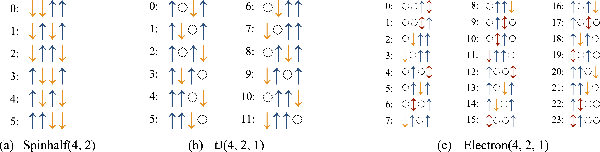

# Hilbert spaces

Quantum many-body physics describes systems built from elementary degrees of freedom such as **spins**, **fermions**, or **bosons**. The central object used to describe any such system is its **Hilbert space**, the vector space spanned by all possible configurations of the constituent particles. Before performing any computation, we therefore need to define the Hilbert space our model lives on.

In XDiag, a Hilbert space is represented by a **block**. Every block enumerates a computational basis of product states and provides a well-defined ordering of these basis states. XDiag features five distinct block types, one for each kind of degree of freedom (spins, spinful and spinless fermions, and bosons); we introduce them one by one below.

## Creating a Hilbert space

The simplest Hilbert space is the one of $N$ spin-$1/2$ degrees of freedom. We create it as an object of type [Spinhalf](../documentation/blocks/spinhalf.md), handing as an argument the number of physical sites $N$.

=== "Julia"
	```julia
	--8<-- "examples/user_guide/main.jl:usage_guide_hs1"
	```
=== "C++"
	```c++
	--8<-- "examples/user_guide/main.cpp:usage_guide_hs1"
	```

## Iterating over a Hilbert space

We would like to know which configurations the Hilbert space is made up of. To do so, we can iterate over the block, print out each configuration, and query the total Hilbert space dimension.

=== "Julia"
	```julia
	--8<-- "examples/user_guide/main.jl:usage_guide_hs2"
	```
=== "C++"
	```c++
	--8<-- "examples/user_guide/main.cpp:usage_guide_hs2"
	```

Each element returned by the iteration is a [ProductState](../documentation/states/product_state.md), i.e. a single basis state in which every site carries a definite local configuration. A `ProductState` behaves like a list of per-site local quantum numbers: the configuration on site `i` can be addressed individually using the `[]` operator.

The `to_string(pstate)` function converts a product state into a string. Note that this prints only the raw **integer** local quantum numbers, one per site. This is a deliberate design choice: the integers are the internal representation, but on their own they do not reveal which physical configuration a given number corresponds to (for instance, whether `0` denotes an empty site or a $\downarrow$-spin). To obtain a human-readable configuration, one passes the block as a second argument, `to_string(pstate, block)`, which knows how to map each integer to a physical label. The precise mapping for every block type is documented on the respective [block pages](../documentation/blocks/spinhalf.md).

The basis states of a block are enumerated in a fixed internal order. This ordering matters: it determines how the coefficients of a wave function are laid out in memory, and it is what we rely on when interpreting the entries of a state vector. Conversely, given a `ProductState`, we can retrieve its position within this enumeration using the `index` function of the block. An important difference between C++ and Julia is that indices are counted starting from `0` in C++ and `1` in Julia. Hence, in the above code snippet, the C++ version will start counting the indices from `0` and Julia from `1`.

XDiag also features a convenient way to write logs in C++ with the [Log](../documentation/utilities/logging.md) class. The first argument to `Log()` is a format string, using the [fmt library](https://fmt.dev/) for formatted output, and the second argument is the value to be printed.

## The five block types

At present, XDiag features five distinct types of Hilbert spaces:

* [Spinhalf](../documentation/blocks/spinhalf.md): $S=1/2$ spins; each site is either occupied by an $\uparrow$-spin or a $\downarrow$-spin.
* [tJ](../documentation/blocks/tJ.md): spin $S=1/2$ electrons without double occupancies; each site is either empty $\emptyset$, occupied by an $\uparrow$-spin or $\downarrow$-spin electron.
* [Electron](../documentation/blocks/electron.md): spin $S=1/2$ electrons; each site is either empty $\emptyset$, occupied by an $\uparrow$-spin or $\downarrow$-spin electron, or is doubly occupied $\updownarrow$.
* [Boson](../documentation/blocks/boson.md): bosons with a fixed local dimension $d$; each site can be occupied by $0, 1, \ldots, d-1$ particles. This block also describes general spin-$S$ degrees of freedom, and is therefore aliased as `Spin`.
* [Fermion](../documentation/blocks/fermion.md): spinless fermions; each site is either empty $\emptyset$ or occupied by a single fermion.

## Normal ordering of fermionic blocks

For the fermionic blocks [Fermion](../documentation/blocks/fermion.md), [tJ](../documentation/blocks/tJ.md), and [Electron](../documentation/blocks/electron.md), the sign of matrix elements depends on the order in which the fermionic operators are arranged. XDiag therefore fixes a **normal ordering** convention, which defines how each computational basis state is built by acting with creation operators on the vacuum $|0\rangle$. Fixing this convention is what makes the Jordan-Wigner signs of the operators unambiguous.

* For the [Fermion](../documentation/blocks/fermion.md) block (spinless fermions), a basis state is created by applying the creation operators $c_i^\dagger$ in ascending order of the site index,

$$ c_{i_1}^\dagger c_{i_2}^\dagger \cdots c_{i_n}^\dagger |0\rangle, \qquad i_1 < i_2 < \cdots < i_n. $$

* For the [Electron](../documentation/blocks/electron.md) and [tJ](../documentation/blocks/tJ.md) blocks (spinful electrons), **all $\uparrow$-operators are placed to the left of all $\downarrow$-operators**, and within each spin sector the sites are again ordered ascendingly,

$$ \Big(\prod_i (c_{i\uparrow}^\dagger)^{n_{i\uparrow}}\Big) \Big(\prod_j (c_{j\downarrow}^\dagger)^{n_{j\downarrow}}\Big) |0\rangle. $$

  The [tJ](../documentation/blocks/tJ.md) block uses the same convention but forbids doubly occupied sites.

Whenever an operator is applied, XDiag automatically brings it into this normal order and accounts for the fermionic signs picked up along the way, so users do not need to track these signs by hand.

## Blocks with conserved quantities

Frequently, many-body systems feature certain symmetries and conservation laws. Common conservation laws include particle number, spin, or momentum conservation. The Hilbert space can then be subdivided into blocks, which are labeled by the respective conserved quantities. Blocks of a Hilbert space with a given particle number can be easily created by handing further arguments when constructing the Hilbert space specifying the particle numbers. The number of $\uparrow$-spins in a [Spinhalf](../documentation/blocks/spinhalf.md) block can be specified via,

=== "Julia"
	```julia
	--8<-- "examples/user_guide/main.jl:usage_guide_hs3"
	```
=== "C++"
	```c++
	--8<-- "examples/user_guide/main.cpp:usage_guide_hs3"
	```

For [tJ](../documentation/blocks/tJ.md) and [Electron](../documentation/blocks/electron.md) blocks, the numbers of $\uparrow$- and $\downarrow$-spins are given separately. A [Boson](../documentation/blocks/boson.md) block requires the local dimension $d$ as its second argument and optionally conserves the total number of bosons, while a [Fermion](../documentation/blocks/fermion.md) block optionally conserves the total fermion number.

The result of printing out the configurations of specific blocks is shown in the [figure below](#fig-fix-block). This enumeration is important to interpret coefficients of wave functions. By printing out the basis states of spin configurations, the user can also assess how computational basis states are ordered internally in XDiag.

{#fig-fix-block}
